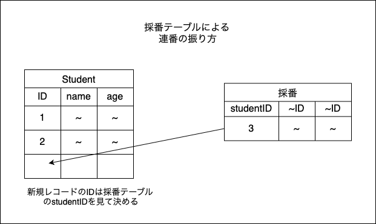

### 自動採番

- カラムのデータとして自動で連番をふる機能

- 基本的にキーに設定する

- DBによるが、基本的に整数のカラムにしか自動設定できない

- DBによるが、MySQLでは<font color="red">採番値が最大値に達した場合、以降は同じ最大値が振られ続ける。</font>よって重複キーエラーなどで、新規レコードが登録できなくなることがあるので注意が必要

- DBによるが、MySQLではテーブルごとに1カラムしか自動採番を設定できない

---

### 自動裁判機能の使い方(MySQL)

- MySQLでは整数型のカラムにAUTO_INCREMENTを定義する

```sql
CREATE TABLE <table_name> (
    col1 INT PRIMARY KEY AUTO_INCREMENT,
    <cols> ...
);
```

- ALTER TABLEでの利用方法　
```sql
ALTER TABLE <table_name> MODIFY <col> <データ型> AUTO_INCREMENT;
```
*MySQLではキーのカラムにしかAUTO_INCREMENTを設定できない

- ALTER TABLEでAUTO_INCREMENTの開始番号を設定する  
*すでにテーブルにはAUTO_INCREMENTが設定されていることが前提
```sql
ALTER TABLE <table_name> AUTO_INCREMENT=val;
```
*table_nameに登録すると、AUTO_INCREMENTのカラムはvalから連番がスタートする

---

### 採番テーブル

- 項目ごとの連番をふるために、その項目の最新の番号を保持するテーブル

- メリット: どのDBでも機能する

- デメリット: 連番をふるためだけにアクセスするテーブルが増える




---

### MAX関数を使ってIDの最大値+1を使えば連番を振れるのでは?

- 結論: 失敗することが多い

- 理由1: 採番中にロックを取得しないと、他のトランザクションから同じ値が読み取られてしまう可能性がある

- 理由2: 最新IDのレコードが削除されると、次の新規登録レコードも同じ番号を使ってしまう

---

### シーケンス (sequence)

- Oracle DB, PostgresSQL, SQL Serverなどで連番をふる機能(カウンターのようなもの)

- MySQLのAUTO_INCREMENTのようにCREATE TABLEで定義ができる
```sql
-- oracle DB
-- GENERATED ALWAYS AS IDENTITYでシーケンス作成
CREATE TABLE <table_name> (
    id NUMBER GENERATED ALWAYS AS IDENTITY
);

-- PostgresSQL
-- SERIAL型で定義することでシーケンス作成
CREATE TABLE <table_name> (
    id SERIAL,
);

-- SQL Server
-- AUTOINCREMENTで定義することでシーケンス作成
CREATE TABLE <table_name> (
    id INTEGER AUTOINCREMENT
);
```

- また、別途シーケンスを作成することができる
    - CREATE SEQUENCEでシーケンス作成
    - DROP SEQUENCEでシーケンスの削除
```sql
-- Oracle DB
-- シーケンス作成
CREATE SEQUENCE <sequence_name>;
-- 現在の最後のシーケンスの値を取得
SELECT <sequence_name>.CURRVAL FROM DUAL;
-- 連番を取得
SELECT <sequence_name>.NEXTVAL FROM DUAL;
-- シーケンスを削除
DROP SEQUENCE <sequence_name>;


-- PostgresSQL
-- シーケンス作成
CREATE SEQUENCE <sequemce_name>;
-- 現在の最後のシーケンスの値を取得
SELECT CURRVAL("<sequence_name>");
-- 連番を取得
SELECT NEXTVAL("<sequence_name>");
-- シーケンスを削除
DROP SEQUENCE <sequence_name>;


-- SQL Server
-- シーケンス作成
CREATE SEQUENCE (<schema_name>.)<sequence_name>;
-- 連番を取得
SELECT NEXT VALUE FOR (<db_name>.<schema_name>.)<sequence_name>;
-- シーケンスを削除
DROP SEQUENCE (<db_name>.<schema_name>.)<sequence_name>
```

--- 

### Oracle DB の　DUALテーブルの意味

- ダミーテーブル
    - 役割: 関数だけを実行したい場合でも、OracleDBはテーブルを指定しないといけないため、その時に指定できる都合のいいテーブル
    　

- SELECT <sequence_name>.CURRVAL FROM DUAL について  
    - 連番を取得する際にも、Oracle DBはテーブルを指定しないといけないので、ダミーテーブルを指定している