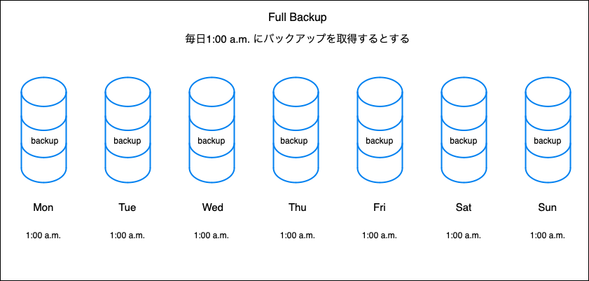
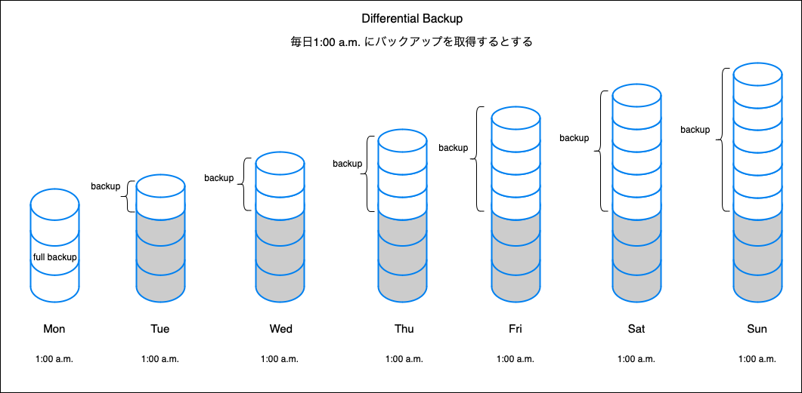
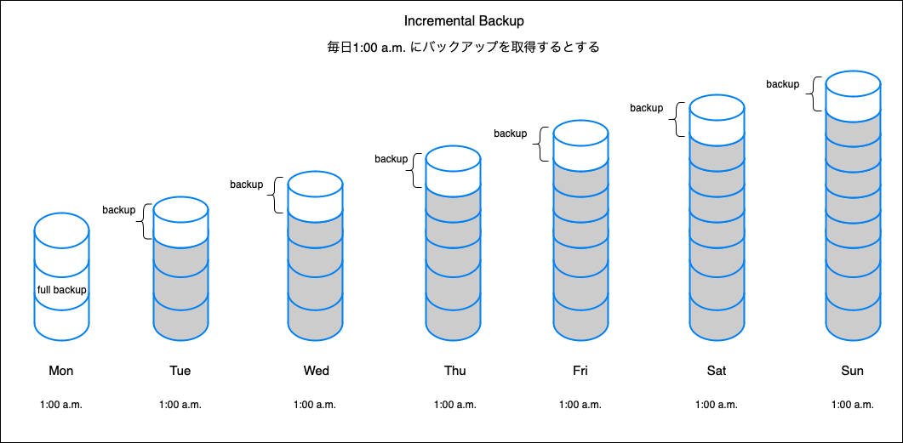

### Backup

- データのコピーを取ること

- 主に3種類のバックアップがある
    - フルバックアップ (full backup)
    - 差分バックアップ (differential backup)
    - 増分バックアップ (incremental backup)

- バックアップのコスト(バックアップデータの量や処理時間)とリカバリのコスト(リカバリのしやすさ)はトレードオフの関係にある

---

### フルバックアップ (full backup)

- バックアップをとる時点において、そのシステムに保存されている全てのデータのバックアップを取得する方法

- 復旧方法
    - 最後に取得したバックアップデータを使う

- メリット
    - 最後にとったバックアップさえあればデータの復旧が可能

- デメリット
    - バックアップ取得の時間が長い
    - メモリの使用量が多くなる
    - 上記の理由から短い周期でフルバックアップをとるのは難しい

---

### 差分バックアップ (incremental backup)

- 初回はフルバックアップをとる

- 初回に取得したバックアップの差分だけ毎回バックアップを取得する方法

- 復旧方法
    - 初回のフルバックアップのデータ + 復旧したい時点まで取得していた中での最新の差分バックアップデータ

- メリット
    - フルバックアップよりもバックアップのデータ量が減る
    - 上記の理由より、バックアップの取得時間がフルバックアップより短くて済む

- デメリット
    - リカバリ(復旧)の時にフルバックアップのデータと、復旧したい時点までの最新の差分バックアップデータの2種類が必要
    - 上記の理由でどちらかのバックアップデータが壊れていた場合、最新の状態まで復旧できない  
    (初回バックアップが生きてた場合: 初回データのみ復旧可能  
    差分データのみが生きていた場合: データの復旧しようがない)

---

### 増分バックアップ (incremental backup)

- 初回はフルバックアップをとる

- 前回行われたバックアップからの差分のみをバックアップする

- 復旧方法
    - 初回フルバックアップのデータ + 復旧したい時点まで取得していた全ての差分バックアップデータ

- メリット
    - 初回以降のバックアップの時間は短くなる
    - 初回以降のバックアップのデータ量は小さくなる

- デメリット
    - リカバリに必要なデータの種類が多くなる
    - バックアップデータのどれか一つでも壊れていたら完全な復旧はできなくなる

