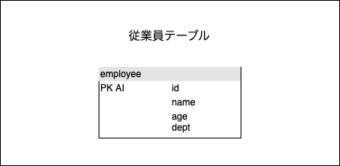
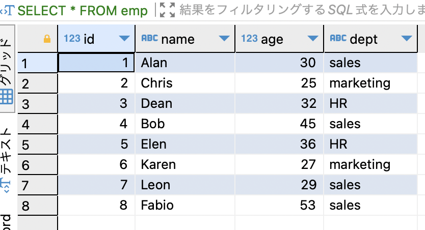

### 相関副問合せとは

- サブクエリ部分で、主問合せのカラムを参照するSQL

例
```sql
SELECT
    <cols>
FROM <tableA>
WHERE EXISTS (SELECT
                <cols>
            FROM <tableB>
            WHERE <tableA>.<col> = <tableB>.<col>); -- ここ
```

---

### 相関副問合せの処理手順

1. 主問合せのテーブルにて1行処理

2. 上記処理の中で、サブクエリ部分が実行され結果に化ける

3. サブクエリ部分の結果を利用し1の処理を完遂する

4. 対象のレコード全てに対して1~3を行う

<br>

例: 以下のempolyeeテーブルから、各部署ごとの平均年齢よりも若い従業員を表示する




```sql
-- show employees who is younger than the average age in his/her dept
SELECT
    name,
    age,
    dept
FROM emp AS emp1
WHERE age <= (SELECT 
                AVG(age)
            FROM emp AS emp2
            WHERE emp1.dept = emp2.dept
            )
```

```
上記sqlの処理手順の解説

1. Alanレコードに対して主問合せの処理を行う
(Alanのdeptはsales)

2. SELECT AVG(age) FROM emp AS emp2 WHERE sales = emp2.dept
が実行される(サブクエリブ部分)
(salesのAVG(age)は 39.25)

3. SELECT name, age, dept FROM emp AS emp1 WHERE age <= 39.25
が実行される(主問合せ部分)
(Alanのageは30。30<=39.25はTRUEなので選択される)

4. Chrisレコードに対して主問合せの処理を行う
(Chrisのdeptはmarketing)

5. SELECT AVG(age) FROM emp AS e2 WHERE marketing = e2.dept
が実行される(サブクエリ部分)
(marketingのAVG(age)は 26)

6. Chrisレコードについて SELECT ~ FROM emp where age<=26
が実行される(主問合せ部分)
(Chrisのageは25。 25<=26はTRUEなので選択される)

7. empテーブルの対象レコード全てに同じ処理を行う
```

<br>

```sql
-- ちなみに、以下のsqlで同じようなことをしたかったが、errorが出てダメだった
SELECT
    name,
    age,
    dept
FROM emp
GROUP BY dept
HAVING AVG(age) <= age;
```
*理由: GROUP BY でグループ化したテーブルのに対するSELECTできるカラムは  
    1. GROUP BY で指定されているグループ化しているカラム  
    2. 集計関数によって集計されるカラム  
だけだから

