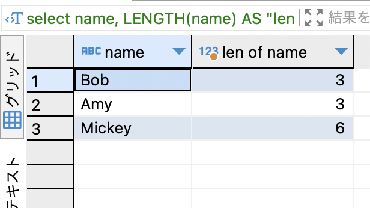
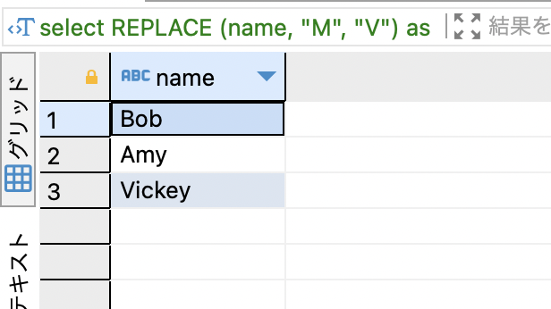
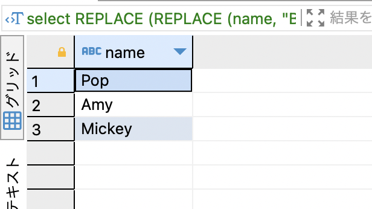
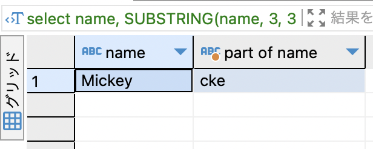

# INDEX

- [関数とは](#sec1)
- [CASE](#sec2)
- [LENGTH / LEN](#sec3)
- [TRIM](#sec4)
- [REPLACE](#sec5)
- [SUBSTRING / SUBSTR](#sec6)
- [ROUND](#sec7)
- [FLOOR](#sec8)
- [TRUNCATE / TRUNC](#sec9)
- [POWER / POW](#sec10)
- [CURRENT_DATE](#sec11)
- [CAST](#sec12)
- [COALESCE](#sec13)
- [関数の入れ子](#sec14)


---
<div id="sec1"></div>

### 関数

- そのまま。渡した引数を元に戻り値を返す。

---
<div id="sec2"></div>

### CASE

値に応じて結果となる値を決めることができる　

書き方
```sql
-- caseの書き方1
CASE <col>
    WHEN <value1> THEN <result1>
    WHEN <value2> THEN <result2>
    ...
    (ELSE <result>)
END;

-- caseの書き方2
CASE
    WHEN <condition1> THEN <result1>
    WHEN <condition2> THEN <result2>
    ...
    (ELSE <result>)
END
```

<br>

```sql
-- caseの書き方1
-- nzの生徒を国内学生、それ以外を留学生として表示する
SELECT
    name,
    CASE country
        WHEN "NZ" THEN "domestic student"
        ELSE THEN "international student"
    END
FROM students;
```

```sql
-- 上と同じ操作だが、違う書き方(書き方2)
SELECT
    name,
    CASE
        WHEN country="NZ" THEN "domestic student",
        ELSE "international student"
    END
FROM students;
```
*ENDの後にASで別名をつけると見やすい
```sql
CASE 
    ~
END AS "<alias>" 
```

---
<div id="sec3"></div>

### LENGTH / LEN

- 渡された文字列の長さを返す

```sql
LENGTH(<(var)char_col>)
```
*DBMSによってはLEN関数のものもある

<br>

```sql
-- 使用例
-- 生徒の名前とその長さを表示する
SELECT
    name,
    LENGTH(namme) AS "len of name"
FROM students;
```



---
<div id="sec4"></div>

### TRIM

- 文字列の前後の空白を取り除く

```sql
TRIM(<(var)char_col>)
```

<br>

- LTRIM: 文字列の前(左側)の空白を取り除く

- RTRIM: 文字列の後(右側)の空白を取り除く

*文字の間のスペースはTRIM系の関数では取り除けない

---
<div id="sec5"></div>

### REPLACE

- 渡された文字列のとある文字を別の文字に置換する

```sql
REPLACE (<(var)char_col>, target string, new string)
```

<br>


例: nameカラム内のMをVに変換する 

```sql
SELECT
    REPLACE (name, "M", "V) AS name
FROM students;
```

result


<br>

- 入れ子にすることで複数の文字の置換ができる
```sql
REPLACE (
    REPLACE (
        <col>,
        target1,
        new1
    ),
    target2,
    new2)
```

例: 学生名のBをP、bをpにreplaceする
```sql
SELECT
    REPLACE (
        REPLACE(
            name,
            "B",
            "P"
        ),
        "b",
        "p"
    ) AS name
FROM students;
```

result


---
<div id="sec6"></div>

### SUBSTRING / SUBSTR

- 対象の文字列のカラムから一部分を抽出する

```sql
SUBSTRING (<col>, strat index, length)
```
*文字のインデックスの数え方はDBMSによって異なるかも  
MySQLでは以下のような数え方
```
string: "abcdef"
index:   012345
```

<br>

例: StudentsテーブルにあるMickeyの3文字目から3文字分を抽出する
```sql
SELECT
    name,
    SUBSTRING(
        name,
        3,
        3
    ) AS "part of name"
FROM students
WHERE name="Mickey";
```

<br>

result


---
<div id="sec7"></div>

### ROUND

- 指定した桁で四捨五入をする

```sql
ROUND (<col>, decimals)
```
*decimals: 四捨五入する桁数(位)

```
decimalsについて
    0だと、少数第一位
    1だと少数第二位
    -1だと整数の1の位
    -2だと整数の10の位
で四捨五入を行う
```

<br>

```sql
SELECT ROUND(345.156, 0);
/*
* -> 345
*/

SELECT ROUND(345.156, 1);
/*
* -> 345.2
*/

SELECT ROUND(345.156, -1);
/*
* -> 350
*/
```

---
<div id="sec8"></div>

### FLOOR

- 少数点以下を切り捨てる

```sql
FLOOR(<col>)
```

<br>

例
```sql
SELECT FLOOR(25.45);
/*
* -> 25
*/

SELECT FLOOR(25.99);
/*
* -> 25
*/
```

---
<div id="sec9"></div>

### TRUNCATE / TRUNC

- 指定した桁で切り捨てる

```sql
TRUNCATE (<col>, decimals)
```
*[ROUND](#sec7)と同じ使い方

<br>

```sql
SELECT TRUNCATE (345.156, 0);
/*
* -> 345
*/

SELECT TRUNCATE (345.156, 1);
/*
* -> 345.1
*/

SELECT TRUNCATE (345.156, -1);
/*
* -> 340
*/
```

---
<div id="sec10"></div>

### POWER / POW

- べき乗を計算する

```sql
POWER (<col>, 何乗するか)
```

<br>

例
```sql
SELECT POWER (10, 2);
/*
* -> 100
*/
```

---
<div id="sec11"></div>

### CURRENT_DATE

- [CURRENT_DATEについてはこちら](./DATE_Type.md)

---
<div id="sec12"></div>

### CAST
 
- データ型の変換を行う

```sql
CASE (<col>, datatype)
```

<br>

例
```sql
SELECT CAST(150 AS CHAR);
/*
* -> CAR型の150
*/

SELECT CAST("2024-01-22" AS DATE);
/*
* -> DATE型の2024-01-22
*/
```

- 文字列 -> 数値のCASTに注意  
    *DBによって結果が違うことがある  
例
```sql
-- "100NZD" (varchar) -> INT

-- あるDBでは変換できるところまでを数字にCASTしようとする 
SELECt CAST ("100NZD", INT);
/*
* -> 100
*/

-- 一方、あるDBではCAST Errorになるかも
SELECt CAST ("100NZD", INT);
/*
* -> error
*/
```

- CASTの使いどころの1例  
    - 数値のカラムに文字列を連結したい時

```sql
-- price is a int column in products
-- productsテーブルにてpriceカラムは数値型

SELECT CAST(price AS INT) || "NZD" FROM products;
```

---
<div id="sec13"></div>

### COALESCE

- coalesce: 合体する、融合するの意味

- 最初に登場するNULLではない値を返す
```sql
COALESCE (<col/val>, <col2/val2>, ...) 
```

<br>

```sql
SELECT COALESCE (NULL, "greet", NULL, "bye");
/*
* -> greet
*/

-- 生徒のdescカラムがNULLの時、description is emptyと表示したい
SELECT
    name,
    COALESCE (desc, "description is empty") AS desc
FROM students;
```
*<font color="red">全ての引数がデータ型が一致している必要がある</font>

---
<div id="sec14"></div>

### 関数の入れ子

- 関数の戻り値を他の関数の引数として渡すことができる

```sql
-- 例: trimした文字列の長さを表示する
SELECT
    title,
    LENGTH(TRIM(content))
FROM memo;
```
*実行順は trim() -> length()  

---

