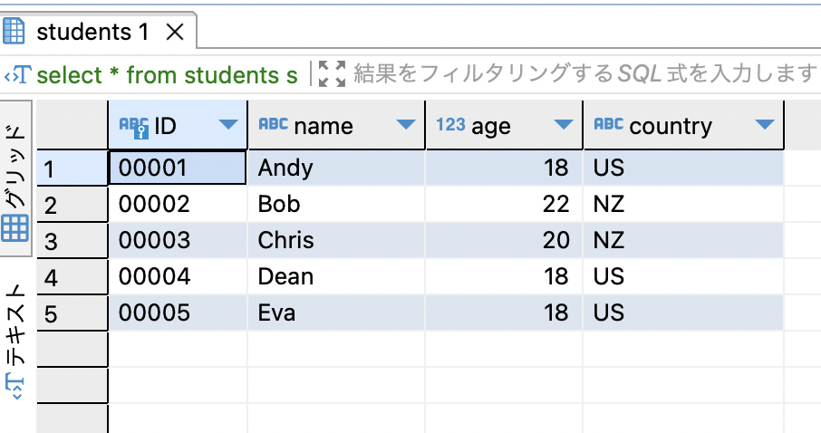
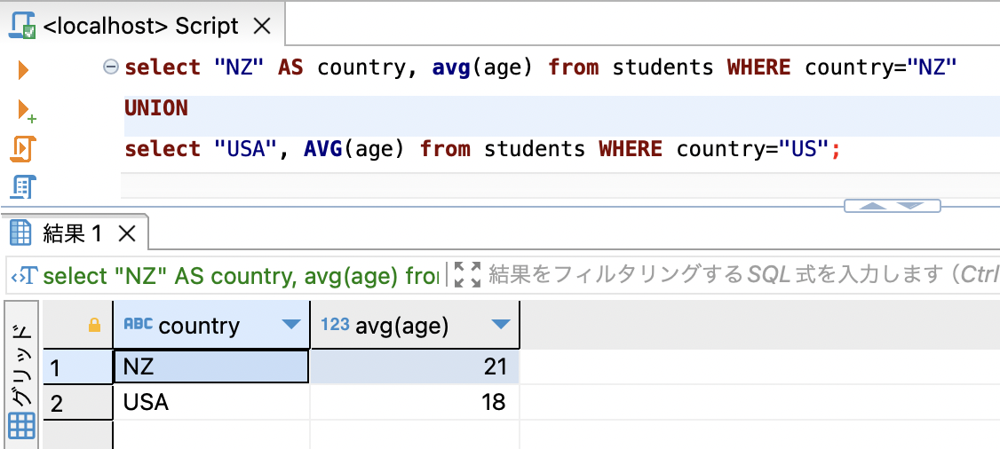
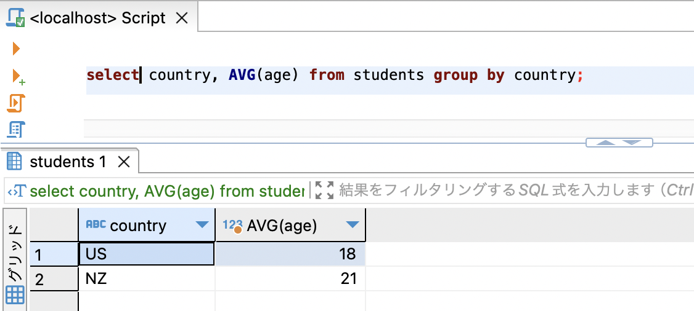
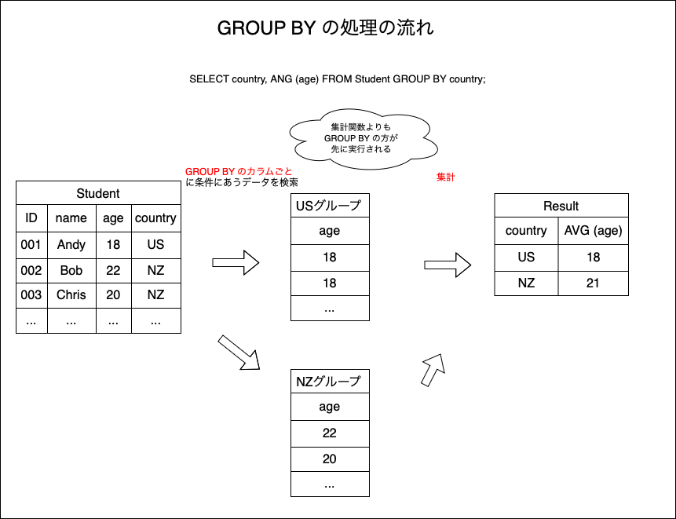
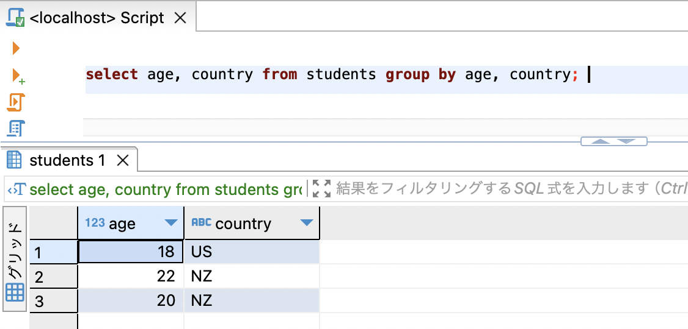
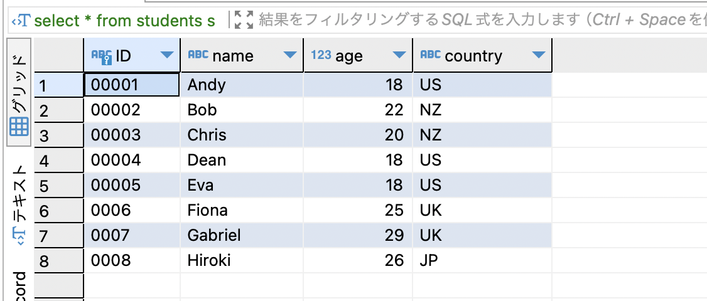
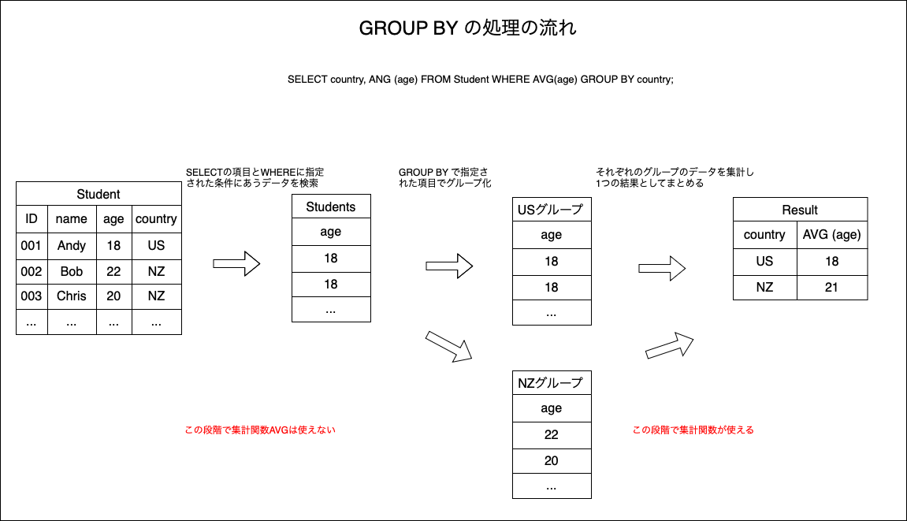
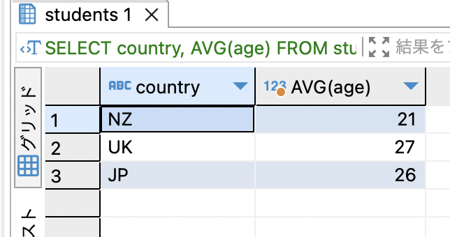
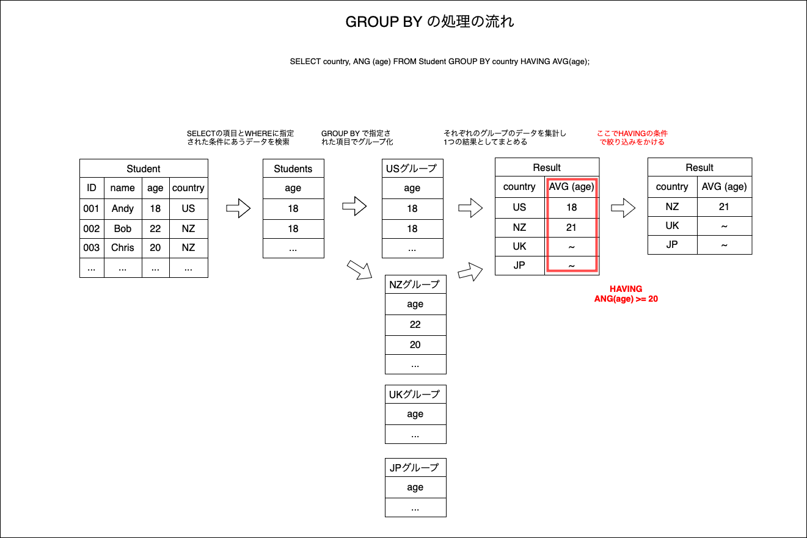

### データをグループに分ける

- 例えば、学生テーブルにおいて国籍ごとの生徒の平均年齢を取得したいときなどに使える


```sql
-- これでも欲しい結果は得られるが、、、
SELECT
    "NZ" AS country,
    AVG (age)
FROM students
WHERE country="NZ"
UNION
SELECT
    "US",
    AVG (age)
FROM students
WHERE country="US";
```


<br>

- GROUP BY  
    - 指定したカラムの項目ごとにグループ分けしてくれる機能

```sql
SELECT
    country,
    AVG (age)
FROM students
GROUP BY country;
```


---

### GROUP BY　の流れ



1. SELECTで指定された行の選択やWHEREで指定された条件に合うデータの検索

2. 検索結果を指定されたグループごとにまとめる

3. グループごとのテーブルに集計をかける

4. それぞれの集計結果などを一つの検索結果としてまとめる(必要であれば並び替えも行う)

---

### ORDER BY はどこに書けばいいのか

```sql
SELECT
    <cols>
FROM <table>
GROUP BY <col>
ORDER BY <col>; -- ORDER BY はここ
```
*ORDER BY は集計結果を並び替えるための命令だから

---

### GROUP BY に複数の項目を使う

```sqls
GROUP BY <col1>, <col2> ..
```

こんなこともできる

上記SQLはstudentsテーブルのデータをageとcontry項目のグループにまとめる。  
結果、studentsは18歳USか、20歳NZか、22歳NZの学生しかいないことがわかった。

---

### GROUP BY と HAVING

平均年齢が20歳以上のグループの国籍を表示したい


```sql
SELECT
    country,
    AVG(age)
FROM students
WHERE AVG(age) >= 20
GROUP BY country;

-- -> error
```
*WHEREの処理段階では、集計をかけられない


<br>

- グループごとにまとめられた結果に対して絞り込みをかけるには <font color="red">HAVING</font> を使う  

```sql
GROUP BY <col>
HAVING <condition>
(ORDER BY <col>)
```

改めて、平均年齢が20歳以上のグループの国籍を表示したい


HAVINGでグループ化した結果に絞り込みをかける
```sql
SELECT
    country,
    AVG(age)
FROM students
GROUP BY country
HAVING AVG(age) >= 20;
```


-> USの学生のグループの平均年齢は19歳以下ということがわかる  

<br>

- HAVINGも含めた処理内容



---