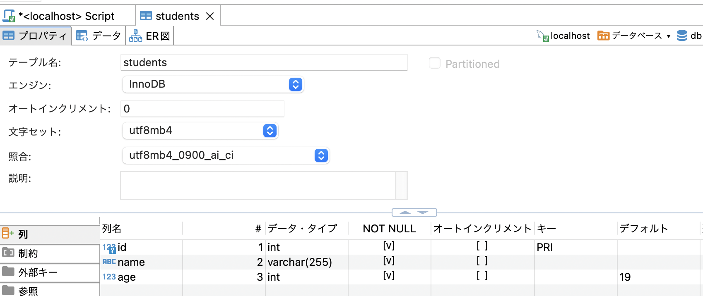

### データの登録のための命令

```sql
INSERT INTO <table_name> (col_name) VALULES (col_value)
```
*全項目にデータを入力する場合col_nameの部分は省略しても良い

---

### 例



上記のようなテーブルがあるとする。  
    - idは主キー  
    - すべての項目がnot null  
    - ageだけデフォルト値の設定がある  

データ登録
```sql
INSERT INTO students (id, name, age) VALUES (1, "Bob", 20);

-- ageはデフォルト設定があるので省略した場合、そのデフォルト値が入る
INSERT INTO students (id, name) VALUES (2, "Amy");

INSERT INTO students VALUES (3, "Mickey", 95);
```

<br>

