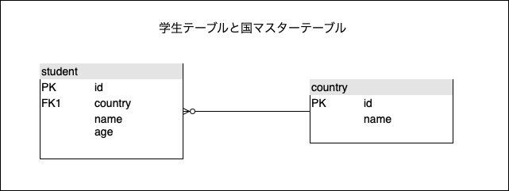
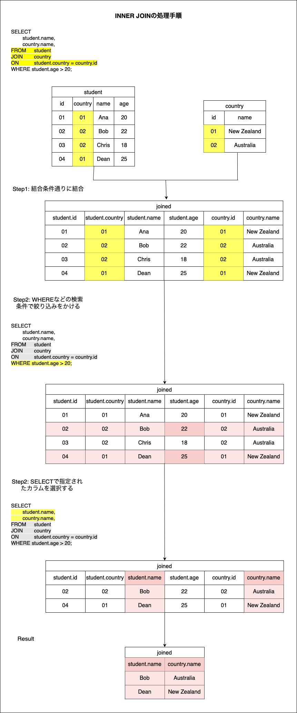
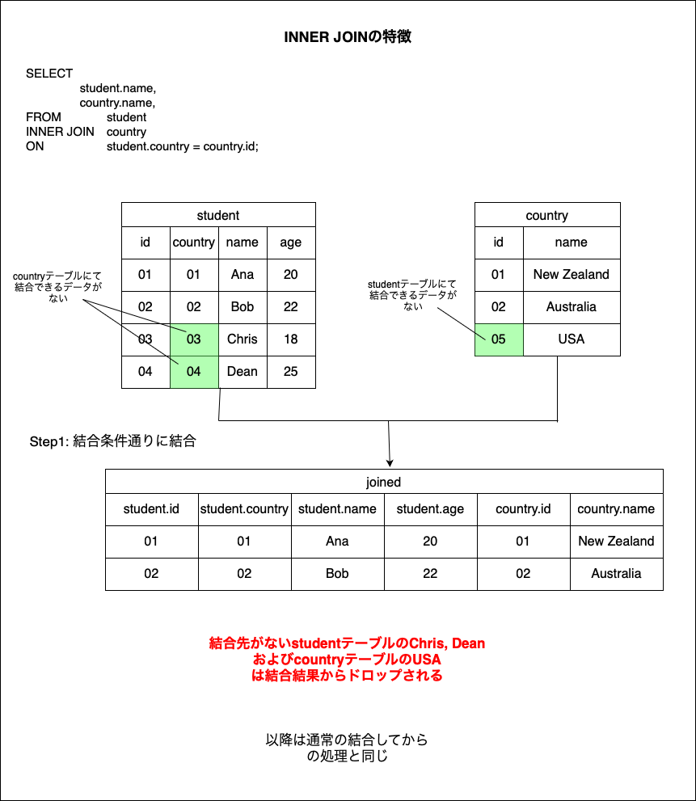

### 内部結合とは

- 2つ上のテーブルを結合条件によってくっつける命令

- 特徴: (いずれのテーブルにおいても)結合条件に一致しない行は結合されず、ドロップされる

---

### 使い方

```sql
SELECT
    <cols> -- cols can be from both tableA and tableB
FROM <tableA>
INNER JOIN <tableB>
ON <tableA_col> = <tableB_col>
(WHERE / GROUP BY / ORDER BY)
;
```
*INNER JOINではなくJOINだけでもいい


---

### 結合の処理手順

1. INNER JOIN ON ~ の結合条件に基づき、テーブルの結合を行う

2. WHEREなどの条件に基づき、結合したテーブルから条件合うレコードを選択

3. SELECTなどで指定されたカラムを選んで表示する

<br>

例:　以下のようなテーブルがある  
学生名とその学生の出身国名を表示したい


```sql
SELECT
    student.name,
    country.name
FROM student
(INNER) JOIN country
ON student.country = country.id;
```



---

### 内部結合の特徴

- (いずれのテーブルにおいても)結合条件に一致しない行は結合されず、ドロップされる



<br>

ざっくりとした結合結果のイメージ


- 結合条件について対象テーブルが過不足なく対応するデータがあれば、INNRT JOIN も OUTER JOIN も同じ結果を返す
