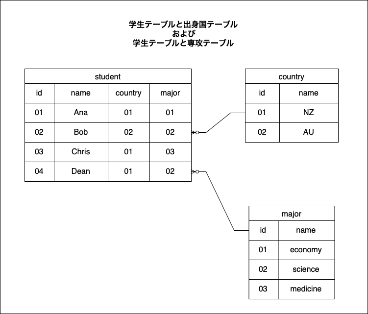
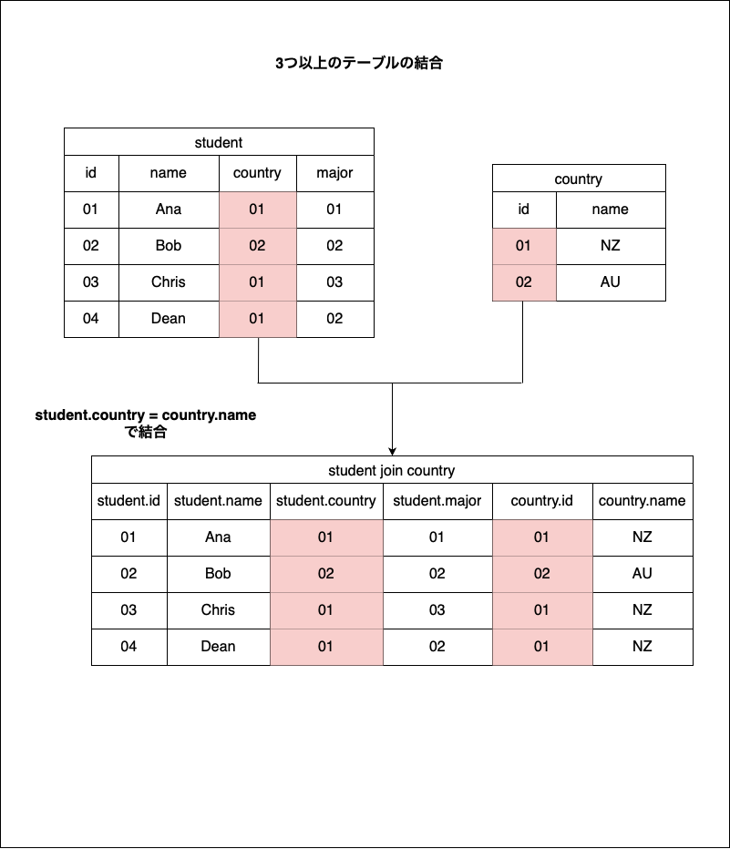
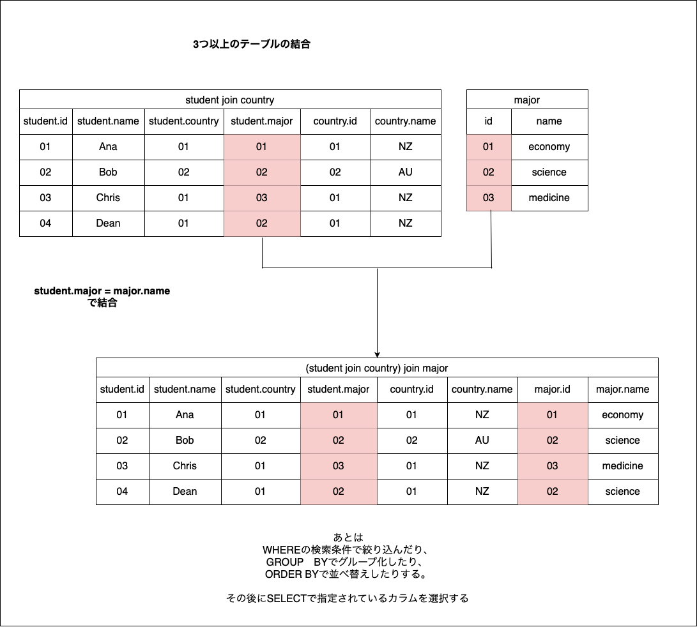

### もっと複雑な結合

1. 3テーブル以上の結合

2. サブクエリとの結合

3. 自身と結合

---

### 3テーブル以上の結合

```sql
SELECT
    <cols>
FROM <tableA>
JOIN <tableB>
ON <tableA>.<col>=<tableB>.<col>
JOIN <tableC>
ON <tableA>.<col>=<tableC>.<col>;
```
*最後の結合条件については\<tableB\>.\<col\> = \<tableC>.\<col\> で結合してもいい

<br>

処理手順

1. tableAとtableBを結合条件に従って結合する

2. 手順1で結合されたテーブルとtableCを結合条件に従って結合する

3. whereとかの条件でさらに絞り込んだり、selectの対象となっているカラムを選択したりする


例


```sql
-- 3つのテーブルを結合し、生徒名、出身国名、専攻名を表示する
SELECT
    student.name
    country.name
    major.name
FROM student
INNER JOIN country
ON student.country=country.id
JOIN major
ON student.major=major.id;
```

<br>

処理手順  
1. studentとcountryを結合条件に従って結合する


<br>

2. 上記で結合されたテーブルとmajorテーブルを結合条件に従って結合する


<br>

3. WHEREとかで絞り込みをかけたりする

4. SELECTで指定されているカラムを選択する

---

### サブクエリとの結合

注意点: カラムの指定や、結合条件に使うために、<font color="red">サブクエリに別名をつける必要がある</font>

```sql
SELECT
    <cols>
FROM <tableA>
JOIN (SELECT ~ FROM ~) AS tableB
on <tableA>.<col>=<tableB>.<col>;
```

---

### 自身と結合 (slef join / recursive join)

注意点: 同じテーブル名同士の結合なので、最低どちらか一方のテーブルには別名をつける必要がある

```sql
SELECT
    <cols>
FROM <tableA> 
JOIN <tableA> AS tableB
ON <tableA>.<col>=<tableB>.<col>;
```
