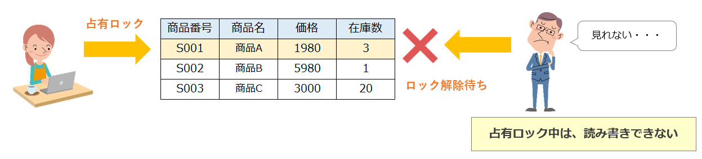

# Index

1. [ACID特性のIsolationについて](#sec1)
2. [同時アクセスによる副作用](#sec2)
3. [Lock](#sec3)
4. [トランザクション分離レベル](#sec4)
5. [トランザクション分離レベルの指定/確認](#sec5)
6. [明示的にロックをかける](#sec6)
7. [排他ロック/共有ロック](#sec7)
8. [デッドロック](#sec8)
9. [ロックエスカレーション](#sec9)


---
<div id="sec1"></div>

### ACID特性のIsolationの部分

- Isolationが実現されないと以下のような事象が起きる可能性がある


---
<div id="sec2"></div>

### 同時アクセスによる副作用

1. ダーティーリード (Dirty Read): コミットされているデータを他のトランザクションが読み込めてしまうこと


[データベース: トランザクション分離レベルについてまとめてみる](https://techracho.bpsinc.jp/kotetsu75/2018_12_14/66410)

<br>

2. 反復不能読み取り (Non-repeatable Read): 同じトランザクション内で更新していないのに再度データを読み込んだ時にレコードデータが変わってしまっていること


[データベース: トランザクション分離レベルについてまとめてみる](https://techracho.bpsinc.jp/kotetsu75/2018_12_14/66410)

<br>

3. ファントムリード (Phantom Read): 同じトランザクション内で登録/削除していないのに再度データを読み込んだ時にテーブルデータが変わってしまっていること


<br>

*これらはあるトランザクション中に、他のトランザクションの処理が割り込めてしまうから起きる問題

---
<div id="sec3"></div>

### Lock

- あるトランザクション中は他のトランザクションは読み書きできないようにする仕組み

---
<div id="sec4"></div>

### トランザクション分離レベル(transaction isolation level)

- どの程度トランザクション同士の影響を分離させるか


[ダーティリード、リピータブルリード、ファントムリードをちゃんと理解してからトランザクション分離レベルを理解しよう](https://qiita.com/momotaro98/items/ad859ec2934ee98540fb)

- Rean Uncommited: 他のトランザクションにて変更されたコミットされていないデータも読み取ることができる

- Read Commited: トランザクションによる更新の際は、常にコミット済みのデータを読み取る

- Repeatable Read: 1つのトランザクションの実行中は、他のトランザクションによるデータの更新の影響は受けない。同じトランザクション中では同じデータは何度読み取りしても毎回同じ値を読むことができる。<font color="red">しかし、他のトランザクションからのデータ登録/削除の影響は受ける</font>

- Serializable: 他のトランザクションの更新/データ登録/データ削除の影響を受けない。名前の通りトランザクションを直列化するイメージ。アクセスが競合すると、他のトランザクションの処理が終わるまで待つ。安全だが、処理が遅くなることが考えられる。


*多くのDBでは Read Commited がデフォルトらしい
*MySQLでは Repeatable Read がデフォルト

---
<div id="sec5"></div>

### トランザクション分離レベルの指定/確認(MySQL)

- トランザクション分離レベルの指定

```sql
/** <レベル名>: READ UNCOMMITTED、READ COMMITTED、REPEATABLE READ、SERIALIZABLE
*/

/**
* GLOBAL: DBサーバー全体に影響がある。サーバー再起動時にデフォルト値に戻る
* SESSION: 現在接続しているクライアントに影響がある。再接続時にデフォルトのグローバル値に戻る
*/

SET [GLOBAL | SESSION]TRANSACTION ISOLATION LEVEL <レベル名>


-- DBによっては
SET CURRENT ISOLATION <レベル名>
```
*MySQLでは、GLOBALレベルとSESSIONレベルを指定して分離レベルを指定する。  
    
*MySQLでは、そのDBサーバーのデフォルトの分離レベルの変更には別途対応が必要

<br>

- トランザクション分離レベルの確認(MySQL)

```sql
SELECT @@global.transaction_isolation, @@session.transaction_isolation;
```

---
<div id="sec6"></div>

### 明示的にロックをかける

- レコード/テーブル/データベースレベルでロックをかけることをできる(DBMSによってはさらにページレベルなどもある)

- このように指定してロックをかけることを"ロックを取得する"という(Locking Level)

#### レコードレベルのロックの取得

- 通常SELECTで検索したレコードは自動的にshared lockがかかる。

- MySQLはSELECT ~ FOR SHAREで shared lock を取得する
```sql
BEGIN;

SELECT
    <cols>
FROM <table>
FOR SHARE;

COMMIT;
```

- レコードレベルの exclusive lock を取得したい場合は以下のように書く
```sql
BEGIN; 

/**
* 通常は他のトランザクションによるロックが解放されるまで処理を待つが、
*NOWAIT オプションを指定した場合は、ロックの解放を待たずにすずにエラーを返し、処理を終了する。
*/
SELECT
    <cols>
FROM <table> ~ 
FOR UPDATE (NOWAIT);

COMMIT;
```

<br>

#### テーブルレベルのロックの取得

- MySQLでは LOCK TABLES を使う

```sql
BEGIN;

/**
* modeについて
* READ: このロックを取得しているトランザクションはテーブルの読み込みのみ可能(shared lockと同じ)
*
* WRITE: このロックを取得しているトランザクションはテーブルの読み取り/書き込みの両方可能(exclusice lockと同じ)
*/
LOCK TABLES 
    <table> <mode>,
    <table2> <mode>;

COMMIT;
```

---
<div id="sec7"></div>

### 排他ロック/共有ロック (exclusive lock / shared lock)

- ロックの方法

- exclusice lock:  
    他のトランザクションからロックのかかってるレコード/テーブル/データベースを更新することも読み取ることもできない
    

    [ロックとは（占有ロックと共有ロック）](https://medium-company.com/占有ロック-共有ロック/)

<br>

- shared lock:  
    他のトランザクションからロックのかかっているレコード/テーブル/データベースの更新はできないが、読み取ることはできる
    

    [ロックとは（占有ロックと共有ロック）](https://medium-company.com/占有ロック-共有ロック/)

---
<div id="sec8"></div>

### デッドロック (Dead Lock)

- 複数のトランザクションがお互いロックしているデータ(レコード/テーブル/データベース)の解放を待っている状態


- デッドロックが発生したら、どちらか一方を失敗させることでそのトランザクションが取得していたロックを解放する。

- そもそもデッドロックを起こさないためにできること
    - トランザクションの時間を短くし、長い時間ロックを取得しない
    - トランザクションからアクセスするテーブルの順番を一貫する

    など

---
<div id="sec9"></div>

### ロックエスカレーション (Lock Escalation)

- DBMSによってはあるレコード数以上のロックがトランザクションによって取得された時、自動的にテーブルロックの取得に切り替える機能を持っている。これをロックエスカレーションという。