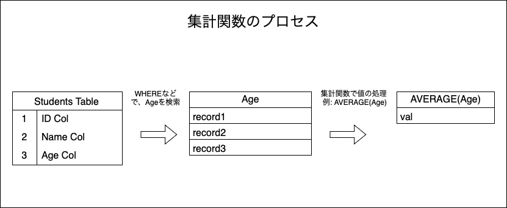
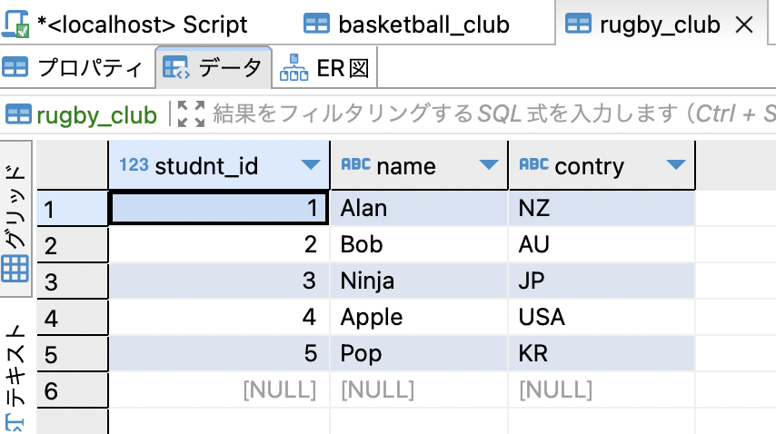
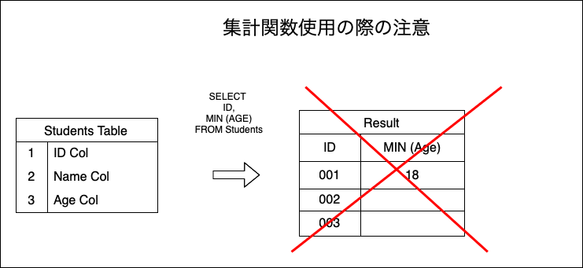

### 計算系の関数

- 集計関数の処理手順
    

---

### SUM

- データ(数値)の合計を計算する

```sql
SUM (<col>)
```
*NULLのデータ無視される  
*全行NULLの場合はNULLが集計結果になる

<br>

例: 
```sql
-- ID=1の顧客の総購入額を計算する
SELECT 
    SUM (purchase) AS "Total Amount"
FROM customer_history
WHERE ID="0001";
```

---

### MAX

- データの最大値を計算する

```sql
MAX (<col>)
```
*NULLのデータ無視される  
*全行NULLの場合はNULLが集計結果になる

<br>

例
```sql
-- 学生テーブルの中で最高年齢を検索する
SELECT
    MAX (age) AS "Oldest Age"
FROM students;
```

---

### MIN

- データの最小値を計算する

```sql
MIN (<col>)
```
*NULLのデータ無視される  
*全行NULLの場合はNULLが集計結果になる

<br>

```sql
-- 学生テーブルの中で最小年齢を検索する
SELECT
    MIN (age) AS "Youngest Age"
FROM students;
```

---

### COUNT

- 検索結果の行数を計算する  
    *NULLがある行のCOUNTに注意  
    COUNT(\*)でカウントすると、<font color="red">NULLの入った行もカウントする</font>  
    COUNT(col_name)でカウントすると、<font color="red">NULLの行は無視してカウントする</font>


```sql
COUNT (<col>)
```
*colに入るのが\*がcol_nameで結果が違うことがある  
- \* -> 検索結果の行数
- col_name -> 検索結果のcol_nameの行数

<br>

例: 全部で6行のデータがあり、最後のデータはすべてのカラムがNULL


```sql
-- ラグビークラブのメンバー数を集計計算する
SELECT
    COUNT (studentID) AS "Num of member"
FROM rugby_club;
/*
* -> 5 (NULLの行はカウントされない)
*/

SELECT
    COUNT (*) AS "Num of member"
FROM rugby_club;
/*
* -> 6 (NULLの行もカウントされる)
*/
```

---

### 集計関数を利用する際の注意点

- 集計計算の結果、テーブルがボコボコの形になってはいけない

```sql
SELECT
    name,
    MIN (age)
FROM students;

/*
* -> error (表の結果がボコボコの形になるのから)
*/
```



<br>

- NULLのデータを0に変換して集計対象にしたい

```sql
MAX/MIN/AVG (COALESCE (col, 0))
```
でcolのデータがNULLの時は0として集計関数に渡すテクニック

