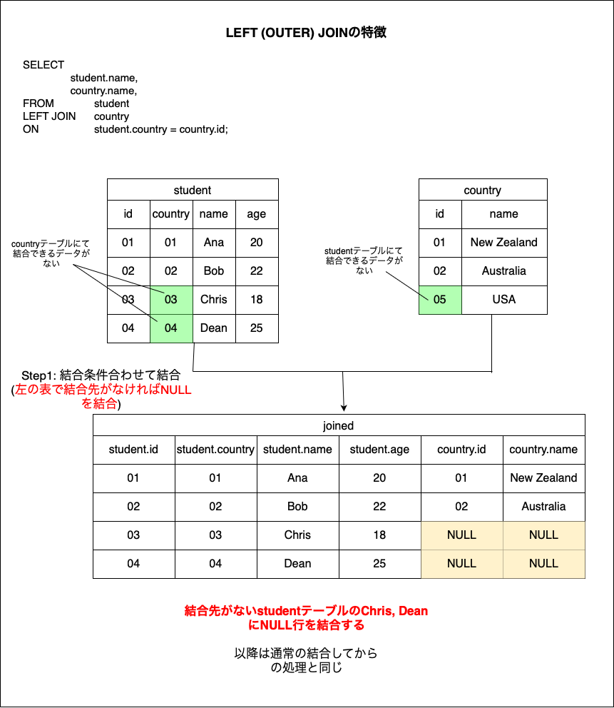
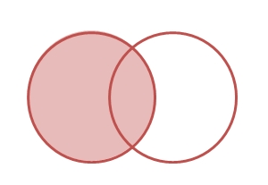
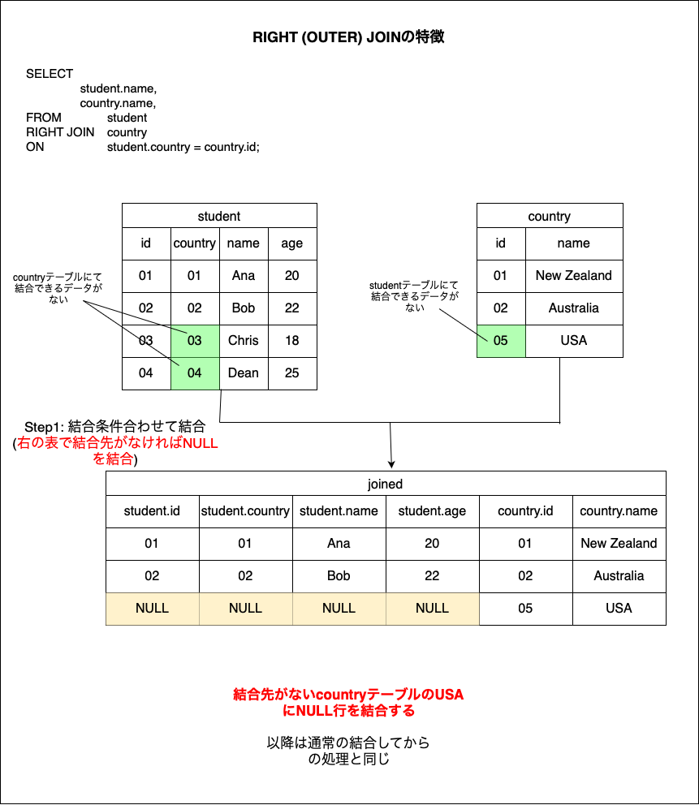
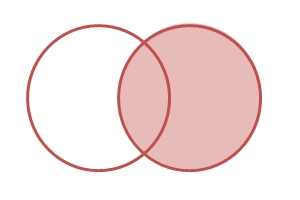
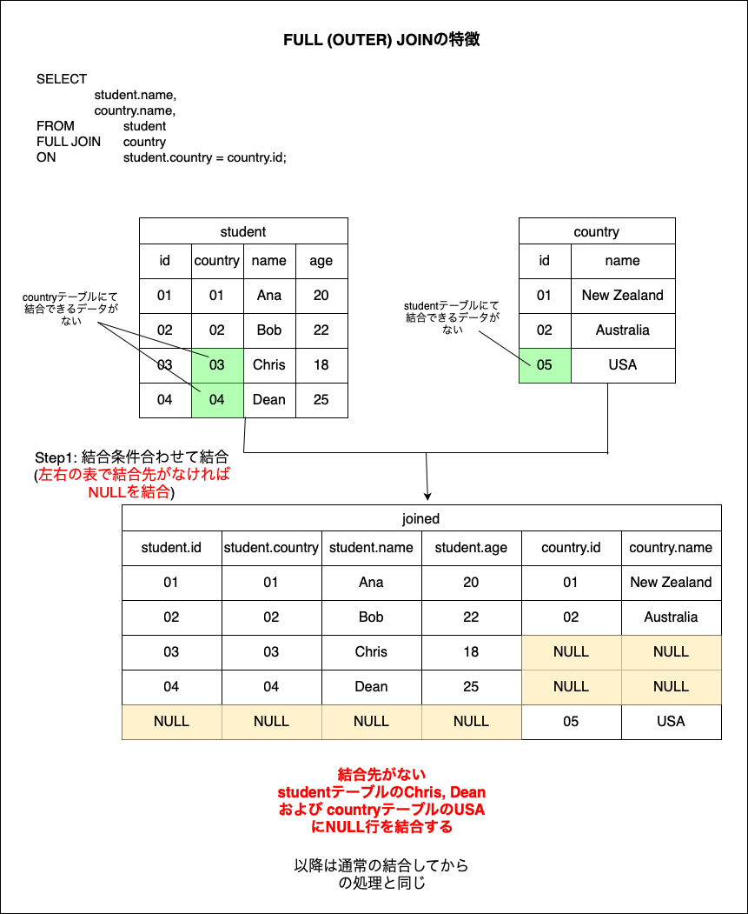
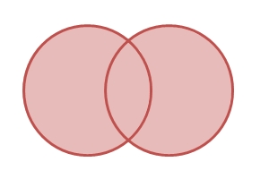

### 外部結合とは

- 2つ上のテーブルを結合条件によってくっつける命令

- 左外部結合(LEFT OUTER JOIN), 右外部結合(RIGHT OUTER JOIN), 完全外部結合(FULL OUTER JOIN) の3種類がある

- 特徴: (一方のテーブルにおいて)結合条件に一致しない行があってもNULL行を作り出して、無理やり結合してしまう

*INNER JOIN は左右どちらについても結合先がなければそのレコードをドロップする 

---

### 使い方

左外部結合(LEFT OUTER JOIN)
```sql
SELECT
    <cols> -- cols can be from both tableA and tableB
FROM <tableA>
LEFT JOIN <tableB>
ON <tableA>.<col> = <tableB>.<col>
(WHERE / GROUP BY / ORDER BY);
```
*LEFT JOIN　ではなく LEFT OUTER JOIN で命令しても良い

<br>

右外部結合(RIGHT OUTER JOIN)
```sql
~
FROM <tableA>
RIGHT JOIN <tableB>
~
```
*RIGHT JOIN　ではなく RIGHT OUTER JOIN で命令しても良い

<br>

完全結合(FULL OUTER JOIN)
```sql
~
FROM <tableA>
FULL JOIN <tableB>
~
```
*FULL JOIN　ではなく FULL OUTER JOIN で命令しても良い

---

### [結合の処理手順はこちらを参照](./Inner_Join.md)

---

### 左外部結合(LEFT OUTER JOIN)

- 左側のテーブル(tableA)で結合先のデータがなくてもNULL行を作り出して無理やり結合する



<br>

ざっくりとした結合結果のイメージ


---

### 右側外部結合(RIGHT OUTER JOIN)

- 右側のテーブル(tableB)で結合先のデータがなくてもNULL行を作り出して無理やり結合する



<br>

ざっくりとした結合結果のイメージ


---

### 完全外部結合(FULL OUTER JOIN)

- 左右どちらのテーブルにおいても、結合先のデータがない場合、NULL行を作り出して無理やり結合する



<br>

ざっくりとした結合結果のイメージ


<br>

*MySQL/MariaDBにはFULL OUTER JOINがない  
FULL OUTER JOINが使えない場合 LEFT OUTER JOIN と RIGHT OUTER JOIN を UNION で結合する

```sql
SELECT
    <cols>
FROM <tableA>
LEFT JOIN <tableB>
ON <tableA>.<col>=<tableB>.<col>
UNION -- ALL で UNION しない限り重複レコードは一つにまとめられる
SELECT
    <cols>
FROM <tableA>
RIGHT JOIN <tableB>
ON <tableA>.<col>=<tableB>.<col>;
```
