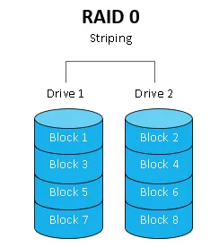
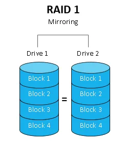
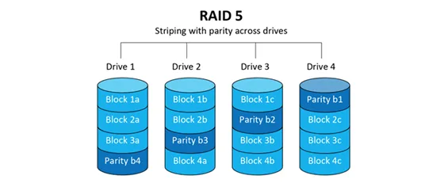
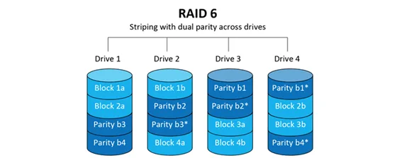
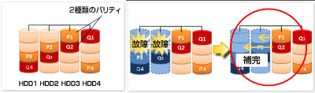
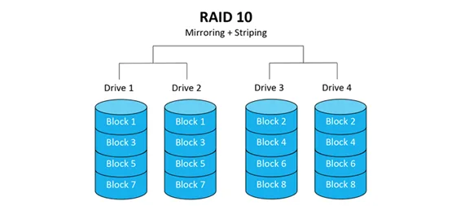
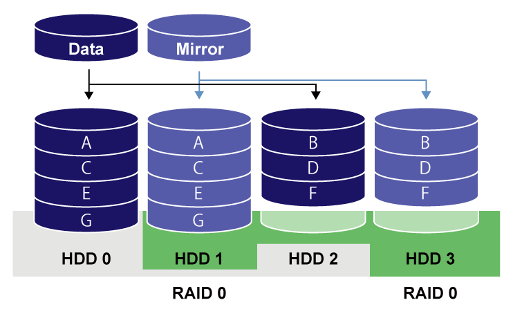

### RAIDとは

- Redundant Array of Independent Diskの略

- 要するにデータを保存するディスクを複数用意し、それをあたかも大きな1つのディスクのように扱う技術

- ディスクにデータを保存する際、データはブロック（セクタ）単位で分割されディスクに書き込まれる

- 基本手的な考え方は、複数のディスクに同じデータを保存しそのうちどれかが壊れても残りのディスクで復旧するというもの

-　復旧以下の目的として、処理スピードの向上がある  
    ```
    例: 2つのデータを書き込みたい  
    もし、1つのディスクしか使っていなかったら最初のデータの書き込みが終わるまで待ち、その後2つ目のデータを書き込むので、待ち時間が発生する  
    一方(RAIDの種類にもよるが)RAIDを使うと、1つ目のデータはディスク1に2つ目のデータはディスク2に同時に書き込まれるので、1つだけディスクを使うよりも早く処理できる
    ```

---

### 主なRAIDの種類

*RAIDの参考画像はこちらから引用  
[RAID Level Comparison: RAID 0, RAID 1, RAID 5, RAID 6 and RAID 10](https://www.dataplugs.com/en/raid-level-comparison-raid-0-raid-1-raid-5-raid-6-raid-10/)

**ディスクにデータを保存する際、データはブロック（セクタ）単位で分割されディスクに書き込まれる**

#### RAID0 (striping)



- 最低2本のディスクから構成される

- 異なるデータを異なるディスクに保持する方法

- 冗長性(同じデータを異なるディスクが持つこと)はないので、どれか1本でもディスクが壊れると復旧できない

- 処理速度を重要視し、データの復旧に重きを置かないシステムで使うが、そんなシステムはほとんどない

<br>

### RAID1 (mirroring)



- 最低2本のディスクから構成される

- それぞれのディスクに全く同じデータを持つ

- 全てのデータが同時に壊れない限りバックアップ可能

- 性能はディスクを1本だけ使っている時と変わらない

- データのバックアップを重要視しているシステムで採用

<br>

#### RAID5



- 最低3本のディスクから構成される

- それぞれのディスクはブロック単位で分割されたデータもしくはパリティを持つ。

- パリティとは: データを記録する際に復元のために計算•生成されるデータのこと。  
もしディスクが1つ壊れたとしても、その他のディスクに保存されているブロックデータとパリティを付き合わせることで元のデータを復元することができる

- 複数ディスクの構成のうち、1本分をパリティデータの保存に使う  
3本のディスクで構成する場合2/3が実際のデータ保存に使われる

- <font color="red">もし、ディスクが2本以上同時に壊れた場合データの復旧がうまくできない可能性がある</font>

- 構成ディスクを増やすほど、1本への書き込みデータが小さくなるので処理スピードが早くなる

<br>

#### RAID6



- 最低4本のディスクから構成される
    - そのうち2本はパリティ用のディスクになる

- 基本的にRAID5と似たコンセプト

- RAID5とは異なり、2種類のパリティを生成する

- 読み込みスピードはRAID5より早いが、書き込む際はパリティを2つ生成するのでRAID5より遅くなる

- <font color="red">もし、ディスクが3本以上同時に壊れた場合データの復旧がうまくできない可能性がある</font>


    [100％安全ではない、耐障害性に優れるRAID6のデータが復旧するまで](https://internet.watch.impress.co.jp/docs/special/564423.html)

<br>

#### RAID10



- 最低4本のディスクから構成される(偶数本のディスクからなる)

- RAID1 と RAID0を組み合わせたもの

- 2本1組のディスクをミラーリング(RAID1)する

- データを書き込む際にデータをブロック単位に分け異なるディスクに書き込むストライピング(RAID0)をする


    [RAIDとは何か？知っておきたい基礎知識](https://www.elecom.co.jp/pickup/column/storage_column/00003/#:~:text=パリティは、HDDに障害,の耐性は高まります%E3%80%82)

- ディスクの壊れ方によっては最大半分のディスクが同時に壊れても大丈夫(上の画像の例ではHDD0とHDD2が同時に壊れても大丈夫)

---

### RAID6 vs RAID10

- ディスク使用率
    - RAID6: 2本はパリティデータの保存に使われる。よってX本のディスクで構成されるとして、 {X - (X-2/X)}%のディスクがデータの保存に使われ、 (X-2/X)%のディスクはパリティの保存に使われる

    - RAID10: 半分は同じデータの保存に使われる。よって50%のディスクがデータ保存、残りの50%は同じデータの保存に使われる。

- 信頼性
    - RAID6: 3本以上のディスクが同時に壊れた場合、データの復旧ができない可能性がある

    - RAID10: どのディスクが壊れるかによるが、最大半分のディスクが壊れてもデータの復旧ができる可能性がある

- パフォーマンス
    - RAID6の方が遅い: パリティの計算があるから

- その他
    - 同じデータ量を保存する場合、RAID10の方が高くつく可能性がある(データを保存するためのディスク使用率は50%だから)