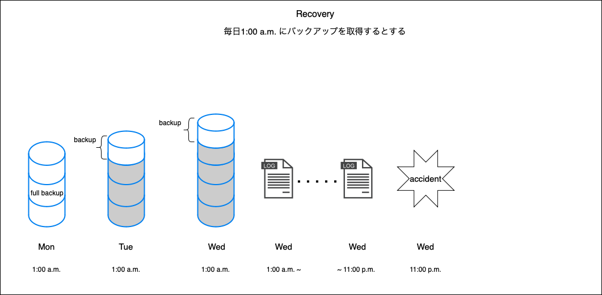

### リカバリーとは

- リストア(restore)とリカバリ(recovery)
    - restore: バックアップデータからデータを復旧すること
    - recovery: リストアした後にトランザクションログなども反映して、問題が発生する直前の状態までのデータを復旧すること

- 一概にリカバリーと呼び、文脈で判断される場合もある

---

### リカバリーについてもっと詳しく

- リカバリーをするためにはデータのバックアップの他にトランザクションログファイルのバックアップも取らないといけない

