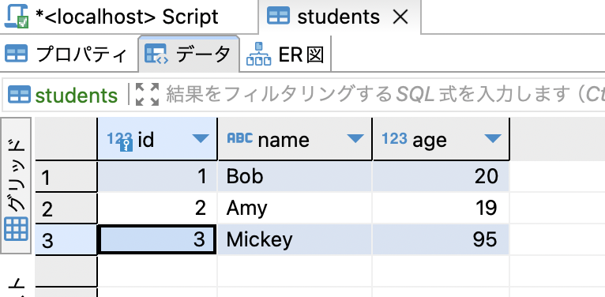
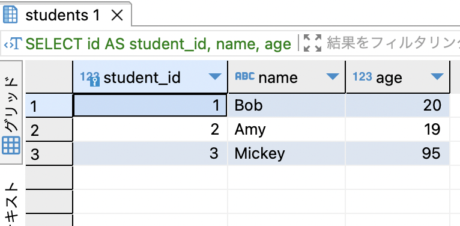

### テーブルからデータを取得する命令

```sql
SELECT <col_name> FROM <table_name>;
```
*全カラム取得したい場合は\<col_name\>に\*を記載する

---

### 条件をつけてデータ取得

```sql
SELECT <col_name> FROM <table_name> WHERE <condition>
```

---

### ASキーワード

- 取得したカラム名に別名をつける  
    *DBMSによって違いあり



idをstudent_idにして取得したい

```sql
SELECT id AS student_id, name, age FROM students;
```
<br>



<br>

*テーブルにも別名をつけることができる  
```sql
SELECT ~~ FROM <table_name> AS <another_name> (WHERE ~);
```