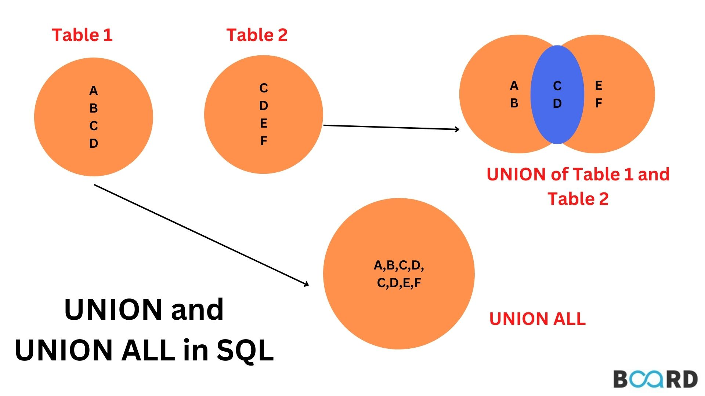
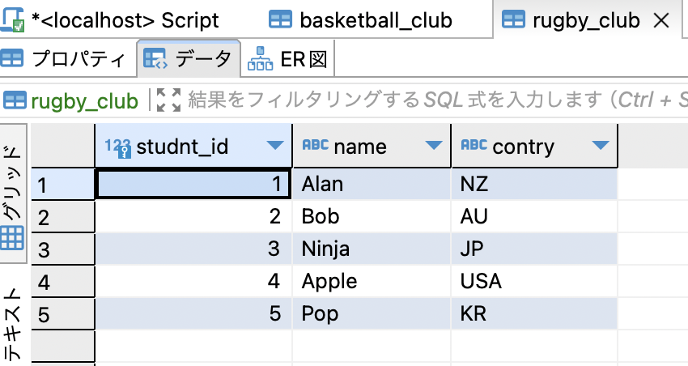
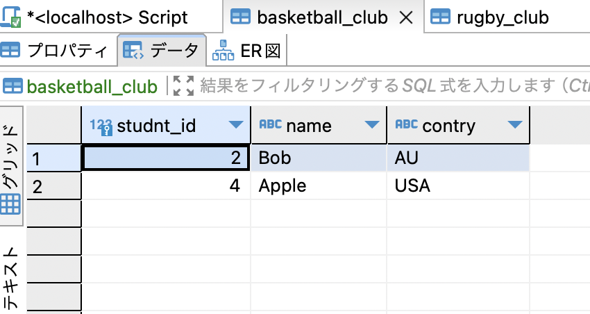
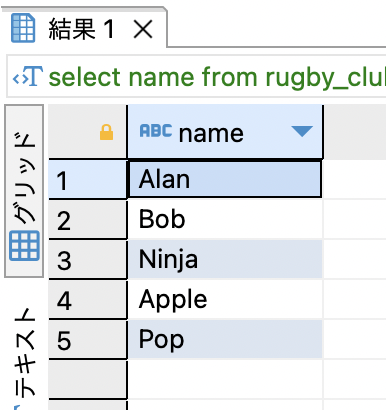
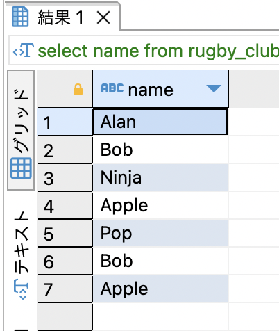
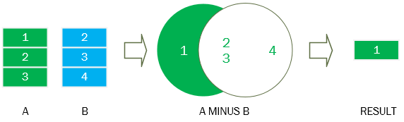
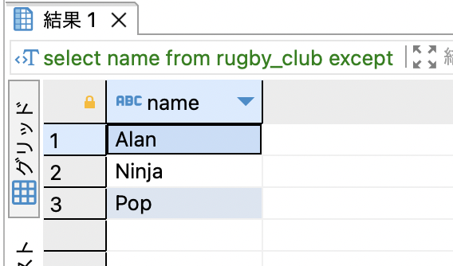
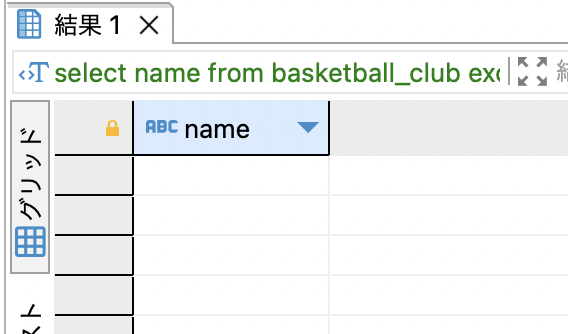
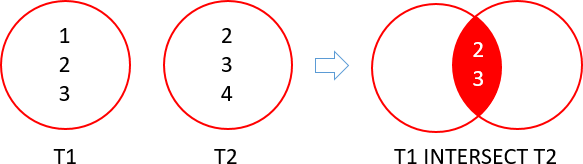
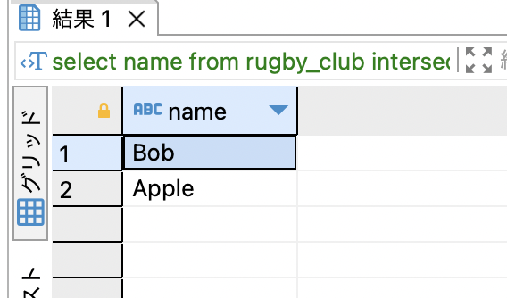

### whereで絞った検索結果を加工する

- 重複行の排除や、検索結果の並べ替えなど

---

### DISTINCT  

- 重複データの削除

```sql
SELECT DISTINCT <col> FROM <table> (WHERE <conditions>);
```

<br>

例: 学生の国籍一覧を取得する
```sql
SELECT DISTINCT country FROM students;
```

---

### ORDER BY  

- 検索結果の並び替え

```sql
SELECT <cols> FROM <table_name> (WHERE <conditions>) ORDER BY <col> <order>;
```
*orderはASC(昇順)とDESC(降順)を指定でき、デフォルトではASC

<br>

例: 年齢の若い順に生徒の情報を取得/表示する
```sql
SELECT * FROM students ORDER BY age;
```

<br>

*並び替えの基準とする行を複数行指定することもできる
```sql
~ ORDER BY <col1> <order>, <col2> <order>, ..;
```
-> col1で同じ値があるデータは、col2を参照して並び替えが行われる

----

### LIMIT

- 先頭から指定された行数分表示する

```sql
SELECT <col> FROM <table> (WHERE ~) LIMIT <row_num> (OFFSET <omit_row_num>)
```
*検索結果の先頭からrow_num行分の検索結果を表示する  
*OFFSETを指定した場合は,omit_row_num行数文スキップしてrow_num行分表示する

<br>

例: 数学の成績TOP3の生徒の情報を表示する
```sql
SELECT name FROM students ORDER BY math_score DESC LIMIT 3;
```

---

### UNION

- 複数の検索結果を足し合わせたものを表示


    [Learn How to Perform Union in SQL?](https://www.boardinfinity.com/blog/learn-how-to-perform-union-in-sql/)

```sql
SELECT <cols> FROM <table1> 
UNION (ALL)
SELECT <cols> FROM <table2>;
```
*UNIONは通常重複行を1行にまとめる  
*ALLを指定した場合、重複行をまとめずに全て表示する

<br>

例: ラグビークラブとバスケットボールクラブの部員の情報を取得する(両方所属している/片方にしか所属していない の両方とも取得する)




<br>

```sql
SELECT name FROM rubgy_club;
UNION
SELECT name FROM basketball_club;
```

result


<br>

もし、UNION ALLだったら  
->両方に所属している部員が2回でてくる(BobとApple)


---

###  EXCEPT (MINUS)

- 複数の検索結果から、重複分を取り除いたものを表示  
    **\*EXCEPT (MINUS)の後の順番に注意**


    [SQL MINUS](https://www.sqltutorial.org/sql-minus/)

```sql
SELECT <cols> FROM <tableA>
EXCEPT (ALL)
SELECT <cols> FROM <tableB>;
```
**ALLをつけると重複行を1つにまとめないで表示する  

```sql
例: EXCEPT と EXCEPT ALLの違い

tableAのデータ
A
A
B
C

tableBのデータ
B

tableA EXCEPT tableB
-> A, C

tableA EXCEPT ALL tableB
-> A, A, C
```

<br>

例: ラグビークラブとバスケットボールクラブのどちらか一方にしか所属していない生徒の情報を取得する
```sql
SELECT name FROM rugby_club
EXCEPT
SELECT name FROM basketball_club;
```

<br>

result


- 以下は同じ結果になるとは限らない
    - \<tableA\> EXCEPT \<tableB\>
    - \<tableB\> EXCEPT \<tableA\>

もしbasketball_club except rugby_clubだったら


理由: \<tableA\> EXCEPT \<tableB\> は tableAからtableBにあるデータを除いたものを表示するから  

---

### INTERSECT

- 複数の検索で重複するものを表示


    [SQL Server INTERSECT](https://www.sqlservertutorial.net/sql-server-basics/sql-server-intersect/)

```sql
SELECT <cols> FROM <T1>
INTERSECT (ALL)
SELECT <cols> FROM <T2>;
```
*ALLをつけると重複行を1つにまとめないで表示する  

```
例: INTERSECT と INTERSECT ALLの違い

tableAのデータ
A
B
C

tableBのデータ
A
B
B
C

tableA INTERSECT tableB
-> A, B, C

tableA INTERSECT ALL tableB
-> A, B, B, C
```

<br>

例: ラグビークラブとバスケットボールクラブの両方の所属している生徒の情報を取得する
```sql
SELECT name FROM rugby_club
INTERSECT
SELECT name FROM basketball_club;
```

<br>

result


---

### UNION / MINUS / INTERSEPTの注意点

- 繋ぎ合わせる2つ以上の検索結果について、全ての検索結果は同じカラム数であることが絶対である。

    -> UNION/MINUS/INTERSEPTは複数の検索結果を1つにまとめる命令であるため、どれか1つでもカラム数が異なれば、1つにまとめることはできない。

- 検索結果のそれぞれのカラムのデータ型一致していなければならない

- 検索結果のカラム数が一致しない場合に使うテクニック
    - 足りない方の検索結果のカラムにNULLを追加する  
    ```sql
    SELECT <col1> <col2> <col3> FROM <table1>
    UNION
    SELECT <col1> <col2> NULL FROM <table2>
    ```

- ORDER BYを使う時は、最後の行のみに使う
    ```sql
    SELECT <col1> <col2> FROM <table1>
    UNION/EXCEPT/INTERSECT
    SELECT <col1> <col2> FROM <table2>
    ORDER BY <col~>; -- ここにORDER BYの条件を書く
    ```

---

### ORDER BYを使う時にきをつけること

- ORDER BYは負荷の高い処理

- インデックスの設計をうまく行うことで、order byの負荷を軽減することができる

- 同様にdistinctやunionなども内部で並び替えを行うケースもあるらしいので使用する際には気をつけること