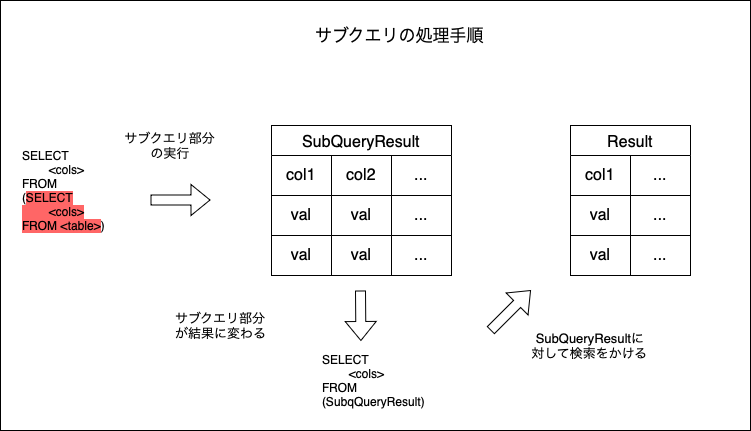
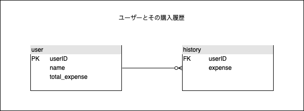
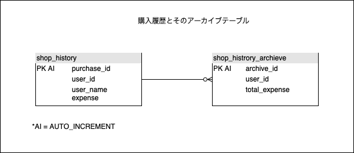

### サブクエリ(副問合せ)とは

- sqlは入れ子構造にすることができる

- その入れ子になったsqlのことをサブクエリと呼ぶ

- サブクエリは()でくくる。くくらないとエラーになる

```sql
SELECT
    <col>
FROM (SELECT <col> FROM <table>);
```
*()の部分がサブクエリ  
*外側のSELECTに指定するカラムはサブクエリで取得したカラム名しか指定できない

---

### サブクエリの処理手順

1. サブクエリの命令を処理する。処理結果が得られる

2. サブクエリで得られた処理結果に対して外側のSQL命令を実行する



---

### サブクエリの様々なパターン

1. SELECTの検索元にサブクエリを用いる



```sql
-- 購入履歴のあるユーザーのみ表示する

SELECT
    name
FROM user
WHERE EXIST (SELECT * 
            FROM history
            WHERE user.userID=history.userID);

```

<br>

2. UPDATEの更新する値にサブクエリを用いる


```sql
-- userのtotal_expenseをhistoryから集計計算して更新する
UPDATE users
    SET total_expense=(SELECT SUM(expense)
                        FROM history
                        GROUP BY userID 
                        HAVING userID=1
                        )
    WHERE userID=1;

```

<br>

3. INSERTで複数行をサブクエリで登録する



<br>

**VALUESはつけてはダメ**
```sql
-- これはerror
INSERT INTO <table> VALUES (SELECT ~ FROM ~);

-- これが正しい
INSERT INTO <table> (SELECT ~ FROM ~);
```
*DBによっては、INSERのサブクエリ部分だけは()でくくってはいけないものもあるっぽい

```sql
-- ユーザーごとに購入金額を合算し、アーカイブテーブルに登録する
INSERT INTO shop_history_archieve
    (SELECT
        NULL,
        user_id,
        SUM(expense)
    FROM shop_history
    GROUP BY user_id);
```
*サブクエリ結果のテーブルがshop_historyテーブルにINSERTされるイメージ

---

