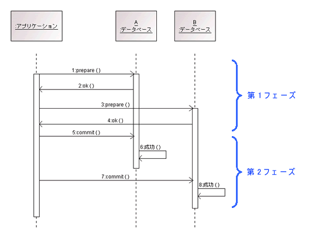

### トランザクションとは

-　処理のまとまった単位

例:
銀行の口座情報を扱うDBにて、AさんがBさんに1,000円送金した。

1. Aさんの残高から-1,000円する
2. Bさんの残高を+1,000円する

上記の1,2は意味的にまとまった処理であり、1トランザクションとするのが普通

---

### トランザクションの制御

DBの操作中に起こって欲しくないこと

- 処理の途中でトラブルが起き中断される
- 処理の途中で(処理対象と同じデータに対して)他の処理の割り込みが起こる

トランザクション制御によって上記の問題が起こらない/起こってもデータの整合性を保つようにするのがトランザクション制御

---

### コミットとロールバック

- コミット: トランザクション(ひとかたまりの処理)を確定すること　

- ロールバック: トランザクションの中断などによってトランザクション中に行われた処理を取り消し、元の状態に戻すこと

*トランザクションが終了すると、すぐにコミットされるわけではなく、"仮の書き換え"として管理される。これを確約することをコミット、棄却することをロールバックというイメージ

---

### ACID特性

- トランザクションを利用するシステムにおいて持つべき特性のこと

1. A (Atomicity): トランザクションはそのかたまりの全てが成功するか失敗するかの2パターンであること

2. C (Consistency): トランザクションはその前後でデータの整合性を保ち、データに設定されたルールや制約を破らないこと

3. I (Isolation): 1つのトランザクションの途中で同じ対象データのトランザクションを同時に実行してはならない。もし、対象のデータが同じ場合、片方のトランザクションが終わるまで、待たなくてはならない。(対象データが違う場合、同時にトランザクションを実行できる)

4. D (Durability): 1度コミットの確約した内容は(障害が起きようとも)不変に保たれること。この特性は、ログのアーカイブをとることなどによって達成される

<br>

Consistencyの例
```
残高テーブルには、口座番号, 残高カラムがあり、残高カラムには0以上のデータしか入らないという制約がある。

とあるトランザクションの後に残高が0以下になってしまったらConsistencyを守っていないということ
```

<br>

Isolationの補足
- トランザクション中のデータのロックにはレベルを設けることができるDBがほとんど
- テーブルレベルのロックやレコードレベルのロックなどがある

---

### トランザクションの利用方法

*DBによっては自動でトランザクションが開始されるため、BEGINを使わないこともある

- BEGIN: その命令以降のSQL分を1つのトランザクションに含める

- COMMIT: トランザクション処理結果の確約をする命令

- ROLLBACK: トランザクション処理結果の棄却をする命令

*COMMITやROLLBACKを行うと、トランザクションが終了するため、再びトランザクションを利用したい場合はもう一度BEGINでトランザクションを張り直す必要がある。

<br>

```sql
-- transfore 100NZD from A to B

BEGIN; -- もしくは START TRANSACTION

UPDATE BANK SET balance=blance-100 WHERE user="A";

UPDATE BANK SET balance=blance+100 WHERE user="B";

COMMIT;
```

---

### 自動コミット

- 自動コミットモードとは1つのsqlが実行されるたびに、コミットされる

MySQLにおいて、現在のコミットモードを調べるためには、以下のSQLで確認できる
```sql
SELECT @@autocommit

/**
* 0: auto commit off
* 1: auto commit on
*/
```

- 自動コミットのオフ

MySQLにおいては以下の方法で自動コミットをオフにできる
```sql
SET autocommit=0;
```

もしくはBEGINを使うことで、コミットかロールバックするまでは自動コミットがオフになる
```sql
-- transfore 100NZD from A to B

BEGIN;  -- ここから auto commit off になる

UPDATE BANK SET balance=blance-100 WHERE user="A";

UPDATE BANK SET balance=blance+100 WHERE user="B";

COMMIT; 
--ここから auto commit on になる
```

---

### 2フェーズコミットとは

- 複数のDBを使ってデータを管理しているシステムにおいて、DB1とDB2にまたがるトランザクションがあるとする

- 上記のようなケースにおいて、コミットするまでに"準備(prepare)"と"確定(commit)"の2段階を設けることによって複数のDBにまたがるトランザクション処理の実現を可能にすることが"2フェーズコミット"

- 具体的に: 
    1. 第1フェーズにて、システムは対象DBに対して準備(prepare)の指示を出す  
    *準備(prepare): コミット可能な状態かどうか

    2. 対象DB全てががコミット可能な状態であれば第2フェーズに進む

    3. 第2フェーズにて、対象DBに対してコミットしていく。もし、どれか1つでも処理が失敗すれば、対象の全てのDBに対してロールバックを行う。



[分散トランザクションに挑戦しよう！](https://www.ogis-ri.co.jp/otc/hiroba/technical/DTP/step2/index.html#ref2)

*第1フェーズにて、全ての対象DBから返事があるまでは待ちの状態になる。第1フェーズの許容時間を過ぎると全ての処理をロールバックする