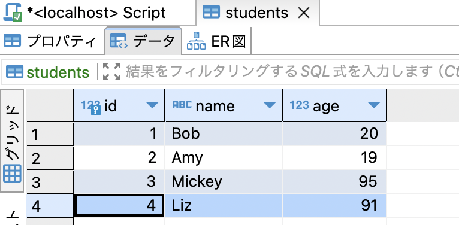
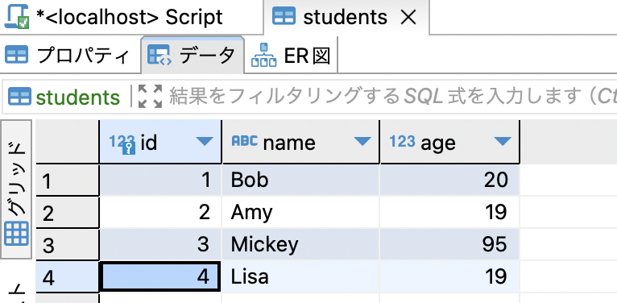

### データの更新のための命令

```sql
UPDATE <table_name> SET <col_name> = <col_value> (WHERE <condition>)
```
*whereで条件をつけないと、全行の対象カラムが更新されてしまう。

---

###　例



id=4をname=Lisa, age=19に更新する

```sql
UPDATE students SET name="Lisa", age=19 WHERE id=4;
```

<br>

