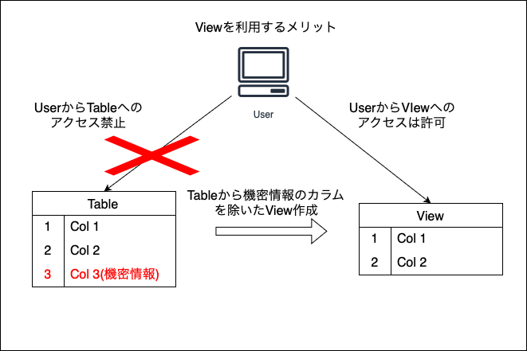
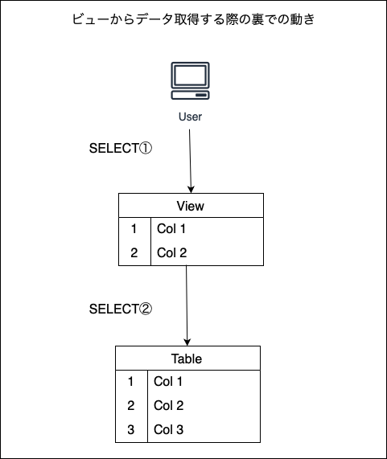

### ビューとは

- SELECT ~ の検索結果をテーブルのように扱える機能

- CREATE VIEWでビューを作成する
```sql
CREATE VIEW <view_name> AS SELECT ~;
```

<br>

- 普通のテーブルのようにビューからデータを取得できる
```sql
SELECT <cols> FROM <view_name>;
```

<br>

- DROP VIEWでビューを削除する
```sql
DROP VIEW <view_name>;
```

---

### 使い方

例: transaction_archieveテーブルの3月分のデータを検索し、それをビューとして作成する
```sql
CREATE VIEW april_transaction
AS SELECT * FROM transaction_archieve WHERE month="April";
```

ビューからデータを取得利用する
```sql
-- 取引金額が30000以上のレコードを取得する
SELECT
    amount,
    payee,
    payer
FROM april_transaction 
WHERE amount > 30000; 
```

----

### ビューのメリット/デメリット

- メリット1: セキュリティ性を高めることができる
    - 以下のように、機密情報が含まれているテーブルから、機密情報を除いたビューを作りユーザーはそのビューのみアクセス可能にすることで、機密情報へのアクセスを防ぐことができる



<br>

- メリット2: SQLをシンブルにすることができる
    - 結合などの結果をビューにすることで、sql分を短くシンプルに書くことができる

<br>

- デメリット1: 多段ビューはパフォーマンスを低下させる。  
ビューはデータを保持するわけではなく、SQL文にエイリアスをつけるイメージ。つまりビューにアクセスするとき、2段階のSQLが発行されて元テーブルからデータを取ってきている。ビューが多段(とあるビューが他のビューから作られているとき、SQLは2回以上発行されるので、処理が遅くなる)



<br>

- デメリット2: テーブルほど自由にデータの登録/削除/更新ができない。  
    DBMSによって条件があり、そのじょう条件を満たした時だけビューに対して上記操作ができる

---

### マテリアライズドビュー (materialized view)

- データを保持するビューのこと

- データを保持するため、ディスク容量を消費する

- データを保持するので、マテリアライズドビューにはインデックスを張れる