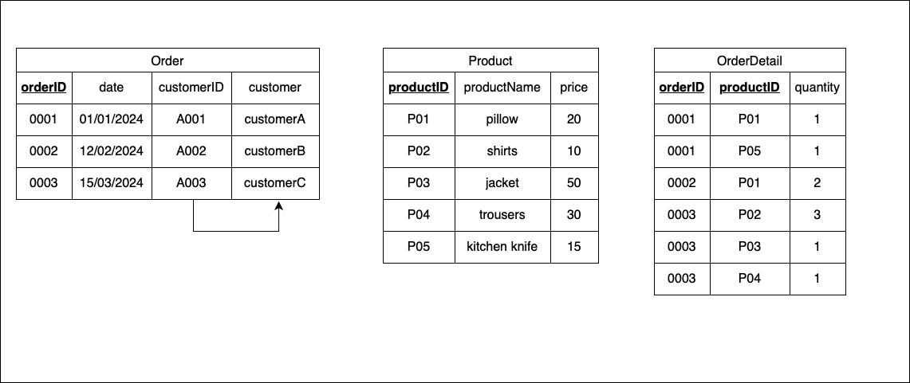
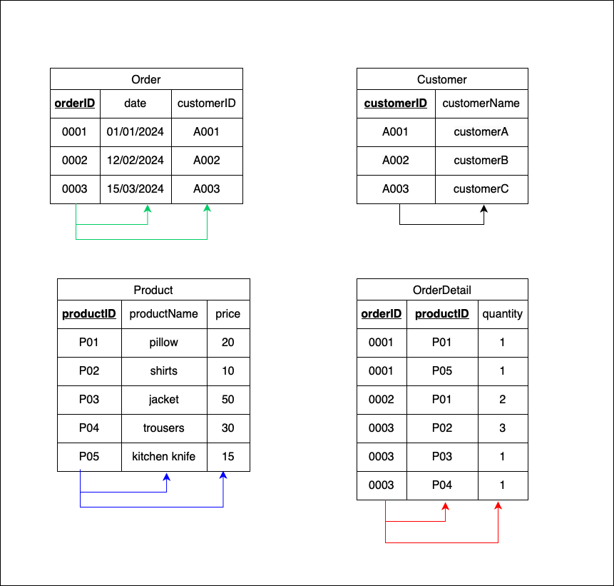
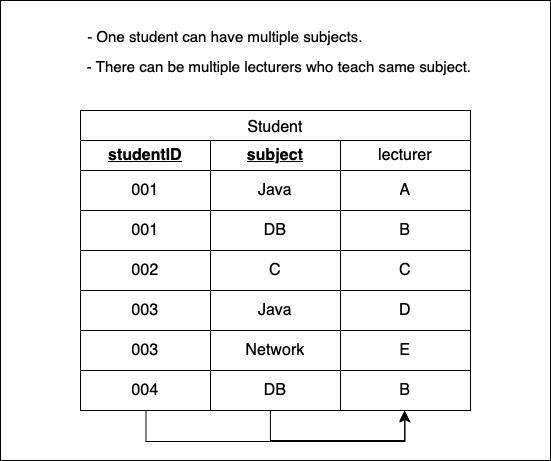
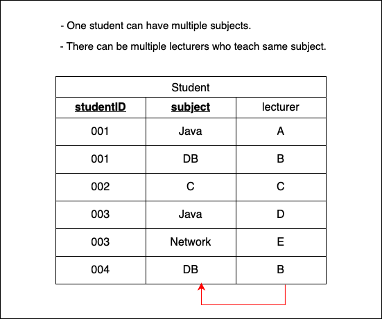
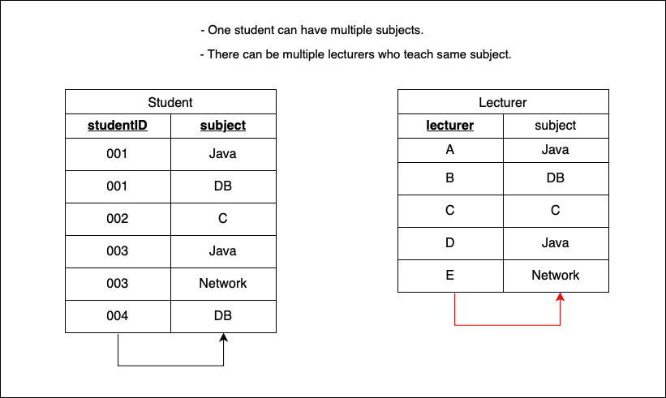
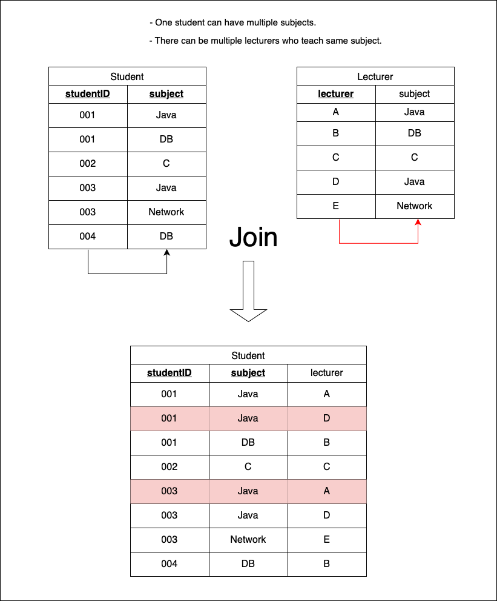
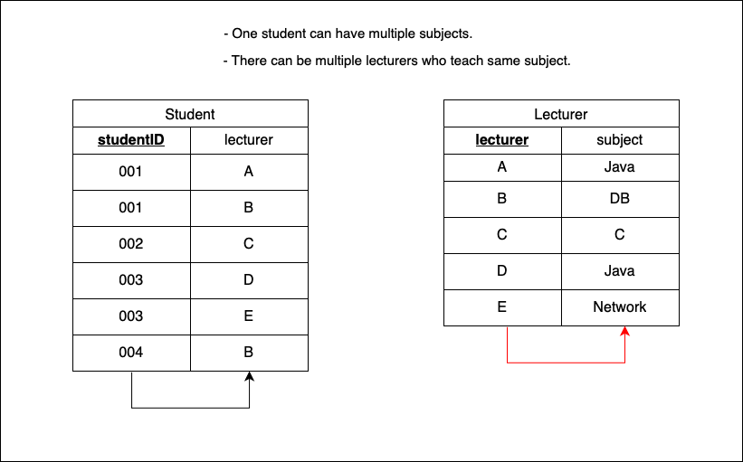
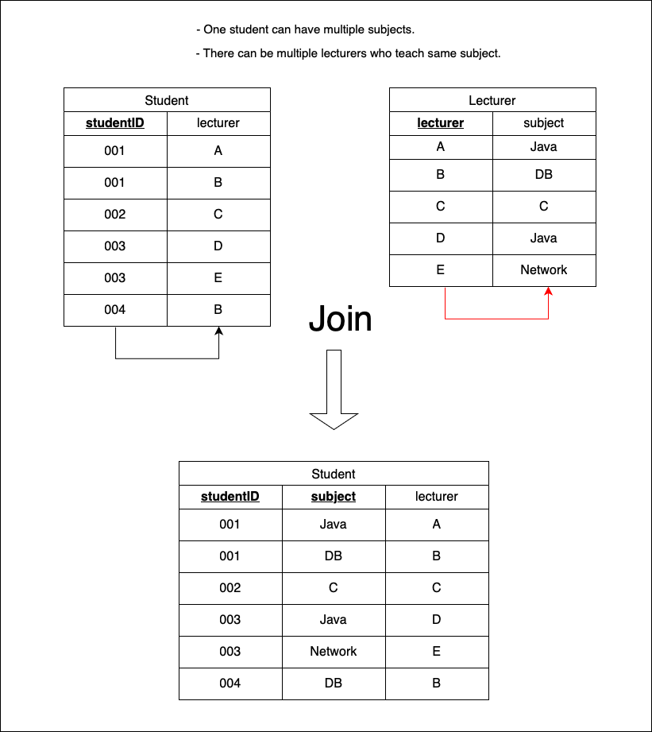

### 正規化 (Normalization)

- 目標: one fact in one place

---

### 正規化の段階

1. 非正規形 (Unnormalized Form)
2. 第1正規形 (1 NF(Normalized Form))
3. 第2正規形 
4. 第3正規形
5. 第3.5正規形 (Boyce–Codd normal form)
6. 第4正規形 
7. 第5正規形

しかし、多くの場合第3正規形までやれば十分なことが多い

---

### 非正規形

- 1つのセルに複数の値が入っている

<br>


---

### 第1正規形 (1NF)

**第1正規形であることの条件**
1. 1レコードの1セルは1つの値しか持たない

第1正規化のTips
- 非正規形から"結合しているセル"や"複数値を持つセル "を排除していく

<br>

- 1つのセルに1つの値だけを持たせるようにテーブルを設計する方法は以下の3つある(どれも第1正規形を満たしている)

1. カラムを増やす


<br>

2. 新しいレコードを挿入する


<br>

3. テーブルを分割する


---

### 第2正規形 (2NF)

**第2正規形であることの条件**
1. 第1正規形を満たすこと
2. 全ての非キー項目が主キー項目に完全関数従属していること = 部分関数従属が含まれていないこと

第2正規化のTips
- 主キーの一部(候補キー)に部分関数従属性 (Partial Dependency) している項目を別テーブルに切り離す

- 主キーに対してすべての非キー属性が完全関数従属しているテーブルを作る

<br>

例: 以下は第1正規形を満たしたテーブル

候補キーは {orderID, productID} もしくは {orderID, prouctName}


<br>

ここで、各項目の関数従属性を見てみると

- {orderID} -> {date, customerID, customerName}  

- {productID} -> {productName, price}

という部分関数従属性があることがわかる


<br>

部分関数従属の関係にあるキーと非キー項目を別テーブルに切り分けることで第2正規形を満たすテーブルを作成する


---

### 第3正規形 (3NF)

**第3正規形であることの条件**
1. 第2正規形を満たすこと
2. 非キーから非キーへの関数従属が存在しないこと

第3正規化のTips
- 推移的関数従属性 (Transitive Dependecy) をなくす
- 各テーブルを完全関数従属 (Fully Dependency) なものにする

<br>

例: 以下は第2正規形を満たしたテーブル


<br>

ここで、 Order テーブルをみると、以下の非キーから非キーへの関数従属性 (推移的関数従属性)があることがわかる

{customerID} -> {customer}



<br>

Transitive dependency にある非キー項目を別テーブルに切り分けることで第3正規形を満たすテーブルを作成する



<br>

各テーブルは完全従属 (fully dependent) なテーブルで第3正規形を満たすテーブルとなる

---

### 関数従属性 (Functional Dependency) とは

- あるレコードにおいて、特定のカラムAの値が決まれば、別のカラムBの値も決まるような関係


---

### 部分関数従属性 (Partial Dependency) とは

- 非キー項目が候補キーの一部に関数従属している関係

-> 候補キーの一部が決まれば非キー項目の値の値も決まる

---

### 推移的関数従属性 (Transitive Dependency) とは 

- 非キー項目が他の非キー項目に関数従属している関係

---

### 完全関数従属性　 (Fully Dependency) とは

- あるテーブルにおいて、全ての非キー項目が主キーの全てに関数従属している関係

- 部分関数従属や推移的関数従属を取り除いた関係

---

### 第3.5正規形 (Boyce–Codd normal form)

**第3.5正規形であることの条件**
1. 第3正規形を満たすこと
2. すべての関係が自明な関数従属性である or 全ての決定項がスーパーキーであるテーブルが 3.5 正規形を満たす

    - 自明な関数従属性: X -> Y の時 Y が X の部分集合であること
        - 例: {productID, productName} -> {productName}

**分解の方法によって、損失分解になってしまうことがあるので注意**

<br>

よくある例: 非キーからキーへの関数従属性を取り除く

以下のテーブルは、非キーは主キーに完全従属であり、第3正規形を満たしている



<br>

しかし、非キーから主キーの一部への関数従属性がある  
{lecturer} -> {subject}



<br>

解決策: subject と lecturer の関係を別テーブルに切り離す



<br>

<font color="red">損失分解 (lossy decompositions)</font>  
-> 本来存在しないデータが JOIN によって生成される or 本来存在するべきデータが JOIN によって失われる

```sql
SELECT studentID, s.subject, lecturer
FROM Student AS s
JOIN Lecturer AS l
ON s.subject = l.subject;
```



<br>

解決策: R1 { studentID, lecturer }, R2 { lecturer, subject } に分ける



<br>

JOIN したら、元のテーブルを作成することができる



<br>

結果  
- Studnet テーブルは全ての決定項がスーパーキー
- Lecture テーブルは全ての決定項がスーパーキー

よって、 Student, Lecturer テーブルは 3.5 正規形を満たすテーブルとなった

---

### 非損失分解

- 正規化によって切り離したテーブル同士を結合すると、切り離す前のテーブルが取得できるようなテーブルの切り離し方


---

### 第4正規形

- 1つのテーブルから複数の多値従属性を取り除く

- 1つのテーブルに最大1つの多値従属があるテーブルに分解する


---

### 多値従属性 (Multivalued dependency)

- 特定の1つのカラムの値に足して、他の(1つの)カラムの値が1つ以上決定する関係
    - 1つのテーブルにカラム A , B , C ... があり、 A が決まると B の集合が決まるという関係

---

### 第5正規形

- 自明でない結合従属性が存在しない状態を目指す

- わかりやすく言うと: 第4正規形を満たすテーブルで、無損失分解できるのであれば第5正規化でそのテーブルを分解することで、第5正規形を満たすテーブルを生成することができる

---

### 結合従属性 (Join dependency)
