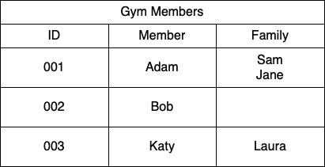
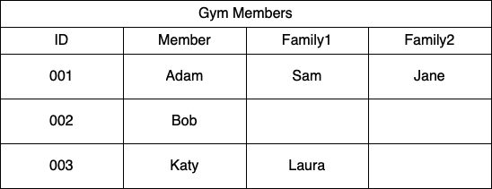
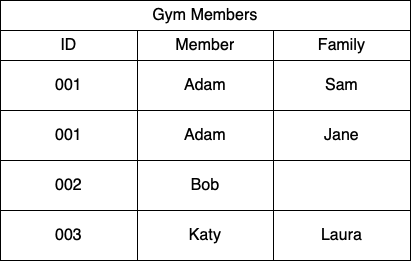
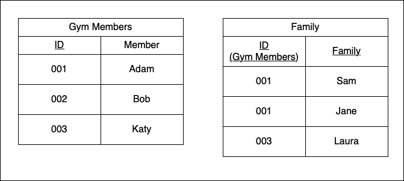
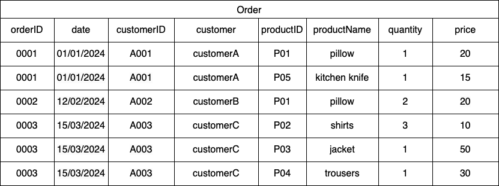
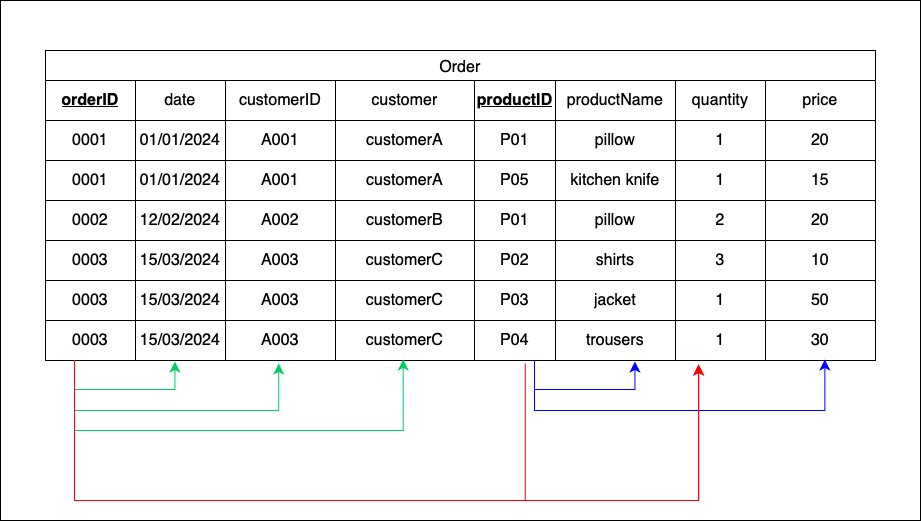
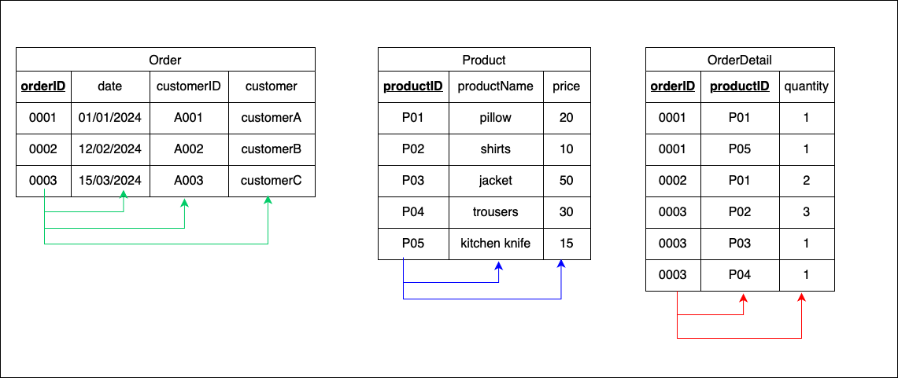
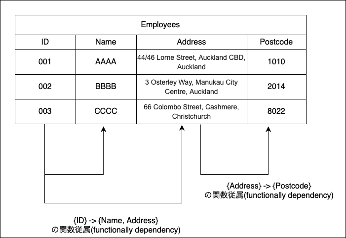

### 正規化 (Normalization)

- 目標: one fact in one place

---

### 正規化の段階

1. 非正規形 (Unnormalized Form)
2. 第1正規形 (1 NF(Normalized Form))
3. 第2正規形 
4. 第3正規形
5. 第3.5正規形 (Boyce–Codd normal form)
6. 第4正規形 
7. 第5正規形

しかし、多くの場合第3正規形までやれば十分なことが多い

---

### 非正規形

- 1つのセルに複数の値が入っている

 

---

### 第1正規形 (1NF)

- 1レコードの1セルは1つの値しか持たない

- 非正規形から"結合しているセル"や"複数値を持つセル "を排除していく作業

 

- 1つのセルに1つの値だけを持たせるようにテーブルを設計する方法は以下の3つある(どれも第1正規形を満たしている)

1. カラムを増やす

 

2. 新しいレコードを挿入する

 

3. テーブルを分割する

---

### 第2正規形 (2NF)

- 主キーの一部(候補キー)に部分関数従属性 (Partial Dependency) している項目を別テーブルに切り離す

- 主キーに対してすべての非キー属性が完全関数従属しているテーブルを作る

 

例: 以下は第一正規形を満たしたテーブル

候補キーは {orderID, productID} もしくは {orderID, prouctName}

 

ここで、各項目の関数従属性を見てみると

- {orderID} -> {date, customerID, customerName}  

- {productID} -> {productName, price}

という部分関数従属性があることがわかる

 

部分関数従属の関係にあるキーと非キー項目を別テーブルに切り分けることで第二正規形を満たすテーブルを作成する

---

### 第3正規形 (3NF)

- 推移的関数従属性 (Transitive Dependecy) をなくす

- 各テーブルを完全関数従属 (Fully Dependency) なものにする

---

### 関数従属性 (Functional Dependency) とは

- あるレコードにおいて、特定のカラムAの値が決まれば、別のカラムBの値も決まるような関係

---

### 部分関数従属性 (Partial Dependency) とは

- 非キー項目が候補キーの一部に関数従属している関係

---

### 推移的関数従属性 (Transitive Dependency) とは 

- 非キー項目が他の非キー項目に関数従属している関係

---

### 完全関数従属性　 (Fully Dependency) とは

- あるテーブルにおいて、全ての非キー項目が主キーの全てに関数従属している関係

- 部分関数従属や推移的関数従属を取り除いた関係